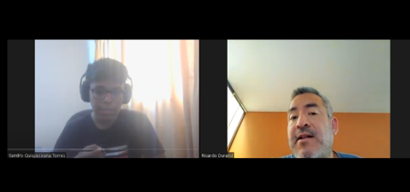
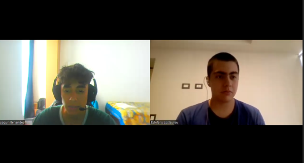

# Universidad Peruana de Ciencias Aplicadas

Ingeniería de Software

Ciclo 2024-01

# 
Desarrollo de Aplicaciones Open Source

## TF1 REPORT

**Sección:** SW51

**Profesor**: Angel Augusto Velasquez Nuñez

**StartUp Name**: NinjaCode

**Producto**: 

### Team Members:

| Member                            |    Code    |
| :-------------------------------- | :--------: |
| Claudio Sandro Quispesivana Torres| U202215099 |
| Jherson David Astuyauri Calderon  | U202218451 |
| Estefano Sebastian Lostaunau Pereira | U202211742 |
| Chinchihualpa Saldarriaga Luis Sebastian | U202212112 |
| Sebastian Valente Lobato Pozo | U202215312 |

 

## Capítulo-II-Requirements-Elicitation-&-Analysis

### 2.1. Competidores

Algunos de los competidores a los que HormonalCare podría enfrentarse son:

- MyTherapy: Esta aplicación permite a los usuarios realizar un seguimiento de su medicación y recordatorios de citas médicas. También ofrece funciones de seguimiento de síntomas y permite crear informes que pueden compartirse con los médicos.

- Cara Care: Es una aplicación diseñada para el seguimiento y tratamiento del acné hormonal. Utiliza inteligencia artificial para analizar fotografías de la piel y proporcionar recomendaciones personalizadas de tratamiento.

- iClinic: Una aplicación de gestión médica que permite a los pacientes llevar un registro de sus consultas médicas, medicamentos, resultados de laboratorio y síntomas. Puede ser útil para el seguimiento de enfermedades hormonales mediante el registro de síntomas y medicamentos recetados.

#### 2.1.1. **Análisis competitivo**

#### 2.1.2.   **Estrategias y tácticas frente a competidores.**

A continuación, vamos a incluir las estrategias y tácticas preliminares que nuestro startup implementará para afrontar a nuestros competidores, de modo que aplicaremos lo siguiente:

- Diseñar una interfaz de usuario intuitiva y amigable, superando la competencia en términos de facilidad de uso y experiencia del usuario.
- Implementar un sistema de seguimiento y análisis de datos avanzado, permitiendo una optimización proactiva de los tratamientos y diferenciándonos por nuestro enfoque basado en la evidencia.
- Brindar un servicio al cliente excepcional, ofreciendo soporte técnico y asesoramiento médico personalizado, destacándonos como una solución integral y confiable.
- Establecer políticas de precios flexibles y competitivas, garantizando una mayor accesibilidad a nuestra solución y capturando diferentes segmentos de mercado.
- Ofrecer un acceso fácil y rápido a la información médica personal, permitiendo a los pacientes monitorear y comprender mejor su condición de salud a través de nuestra aplicación.
- Proporcionar herramientas interactivas para el autocuidado y la gestión de la salud, como recordatorios de medicación, seguimiento de síntomas y consejos de estilo de vida saludable
- Incorporar funciones de telemedicina y consulta en línea, permitiendo a los pacientes acceder a atención médica inmediata y sin barreras geográficas desde la comodidad de sus hogares.
- Garantizar la privacidad y seguridad de los datos del paciente, estableciendo altos estándares de protección de la información personal y médica dentro de la aplicación.

### 2.2. Entrevistas.
#### 2.2.1.   Diseño de entrevistas.

**Para los médicos especialistas:**
1.	¿Cuál es su especialidad médica y cuántos años lleva ejerciéndola?
2.	¿Ejerce su práctica médica en el sector privado o público?
3.	¿Cómo calificaría la satisfacción de los pacientes en los centros de salud tradicionales estatales y cómo cree que una aplicación podría mejorar esta experiencia?
4.	¿Cuáles considera que son las enfermedades más frecuentes en su área de especialización?
5.	¿Cuáles son las mayores dificultades que enfrenta al hacer seguimiento a sus pacientes con enfermedades hormonales?
6.	¿Qué porcentaje de sus pacientes cumple con el tratamiento prescrito y alcanza los objetivos planteados en la evaluación médica?
7.	¿Con qué frecuencia realiza el seguimiento de sus pacientes y si considera que es indispensable realizarlo de manera presencial o puede ser a distancia a través de tecnologías de comunicación?
8.	¿Cuán frecuente es para usted modificar el tratamiento de sus pacientes en función de los resultados de seguimiento, como análisis de laboratorio, peso y síntomas variados?
9.	¿Consideraría que es importante una aplicación para el seguimiento y tratamiento de enfermedades hormonales?
10.	¿Qué ventajas cree que podría ofrecerle a usted y a sus pacientes la utilización de una aplicación para el seguimiento y tratamiento de enfermedades hormonales?
11.	¿Cuáles son las condiciones básicas que deberían cumplirse para que pueda darse una atención efectiva a través de una aplicación?
12.	¿Qué funcionalidades le gustaría que tuviera la aplicación por enfermedad a tratar?, ¿cuáles crees que deberían ser las principales?
13.	¿Cree que la implementación de esta aplicación podría aumentar su cartera de pacientes y la demanda de sus servicios?

Preguntas complementarias:
*	¿Cuál es su nombre?
*	¿Cuántos años tiene?
*	¿En qué localidad labora? 
*	¿Cuál es su estado civil?
*	¿Cuál es su rango salarial aproximado?
*	¿Cuál sería la frase con la que te sientes más identificado?
*	En una escala del 1 al 10, ¿hasta qué punto te sientes motivado por recompensas, reconocimientos o beneficios materiales en tu vida personal o profesional?
*	En una escala del 1 al 10, ¿hasta qué punto sientes que el miedo o la preocupación por ciertas consecuencias te impulsan a tomar decisiones o actuar de cierta manera?
*	En una escala del 1 al 10, ¿hasta qué punto te sientes motivado por alcanzar metas, superar desafíos o destacar en tus actividades?
*	En una escala del 1 al 10, ¿hasta qué punto te sientes motivado por aprender, desarrollarte personal o profesionalmente, y buscar nuevas experiencias?
*	En una escala del 1 al 10, ¿hasta qué punto te sientes motivado por demostrar fortaleza física, mental o emocional, y superar obstáculos?
*	En una escala del 1 al 10, ¿hasta qué punto te sientes motivado por interactuar con otras personas, establecer conexiones sociales y formar parte de grupos o comunidades?
*	¿Qué dispositivos tecnológicos usa más en su cargo como médico?
*	¿Qué sistema operativo usa más en su cargo como médico?
*	¿Cuál es su navegador web favorito?
*	¿Cuáles son las marcas de los dispositivos, artículos o softwares que te ayudan en tu labor en tu día a día?

**Para los pacientes:**
1. ¿Qué enfermedad hormonal padeces y cuánto tiempo llevas siendo diagnosticado/a con ella?
2. ¿Cuáles son las principales dificultades que enfrentas en el seguimiento y tratamiento de tu enfermedad hormonal?
3. ¿Con qué frecuencia visitas a tu médico endocrinólogo para seguimiento y ajuste de tratamiento?
4. ¿Te resulta complicado cumplir con el tratamiento médico prescrito? ¿Qué factores influyen en tu adherencia al tratamiento?
5. ¿Qué aspectos de tu tratamiento o seguimiento médico te gustaría que fueran más fáciles o convenientes?
6. ¿Has tenido alguna experiencia negativa o frustrante en la atención médica relacionada con tu enfermedad hormonal? ¿Qué mejorarías de esa experiencia?
7. ¿Utilizarías una aplicación móvil para llevar un registro de tu historial médico, resultados de análisis hormonales y comunicarte con tu médico?
8. ¿Qué características consideras más importantes en una aplicación diseñada para el seguimiento y tratamiento de enfermedades hormonales?
9. ¿Cómo preferirías recibir recordatorios o alertas sobre tu medicación y citas médicas?
10. ¿Qué información te gustaría poder compartir con tu médico a través de una aplicación para facilitar tu seguimiento y tratamiento?
11. ¿Te sentirías más seguro/a con la posibilidad de comunicarte con tu médico de forma remota a través de una aplicación?
12. ¿Consideras que una aplicación podría mejorar tu calidad de vida y control sobre tu enfermedad hormonal?

Preguntas complementarias:
*	¿Cuál es su nombre?
*	¿Cuántos años tiene?
*	¿En qué localidad vive? 
*	¿Cuál es su estado civil?
*	¿Cuál es su rango salarial aproximado?
*	¿Cuál sería la frase con la que te sientes más identificado?
*	En una escala del 1 al 10, ¿hasta qué punto te sientes motivado por recompensas, reconocimientos o beneficios materiales en tu vida personal o profesional?
*	En una escala del 1 al 10, ¿hasta qué punto sientes que el miedo o la preocupación por ciertas consecuencias te impulsan a tomar decisiones o actuar de cierta manera?
*	En una escala del 1 al 10, ¿hasta qué punto te sientes motivado por alcanzar metas, superar desafíos o destacar en tus actividades?
*	En una escala del 1 al 10, ¿hasta qué punto te sientes motivado por aprender, desarrollarte personal o profesionalmente, y buscar nuevas experiencias?
*	En una escala del 1 al 10, ¿hasta qué punto te sientes motivado por demostrar fortaleza física, mental o emocional, y superar obstáculos?
*	En una escala del 1 al 10, ¿hasta qué punto te sientes motivado por interactuar con otras personas, establecer conexiones sociales y formar parte de grupos o comunidades?
*	¿Qué dispositivos tecnológicos usa más?
*	¿Qué sistema operativo usa más?
*	¿Cuál es su navegador web favorito?
*	¿Cuáles son las marcas de los dispositivos, artículos o softwares que te ayudan en tu labor en tu día a día?

#### 2.2.2.   Registro de entrevistas.
##### >Segmento de usuario – Médicos endocrinólogos.

***Médico 1:***
| Datos del médico: | Entrevista |
|---|---|
|  
Nombres:  Luis Hernán
 
Apellidos: Chinchihualpa Montes
 
 Edad: 53 años
 
 Localidad: Lima
| [Enlace Entrevista](https://upcedupe-my.sharepoint.com/personal/u202212112_upc_edu_pe/_layouts/15/stream.aspx?id=%2Fpersonal%2Fu202212112%5Fupc%5Fedu%5Fpe%2FDocuments%2FShared%2FEntrevista%20endocrin%C3%B3logo%201%2Emp4&ga=1") |
| Resumen:
Luis Chinchihualpa opina que la atención endocrinológica actual presenta dificultades como largos tiempos de espera, escasez de médicos y dificultades en el seguimiento. La telemedicina surge como una alternativa para mejorar la accesibilidad y eficiencia de la atención. Una aplicación de telemedicina ideal debería ser fácil de usar, ofrecer información clara sobre la patología y el tratamiento, permitir el registro de datos del paciente, facilitar el seguimiento del progreso y ser personalizable. La telemedicina tiene el potencial de mejorar la calidad de vida de los pacientes con enfermedades endocrinas.Se concluye que la telemedicina es una herramienta valiosa que puede mejorar significativamente la atención endocrinológica.
 | 

| **Fila 2** |
***Médico 2:***
| Datos del médico: | Entrevista |
|---|---|
|  
Nombres:  Ricardo 
 
Apellidos: Durand
 
 Edad: 48 años
 
 Localidad: Surco
| [Enlace Entrevista](https://upcedupe-my.sharepoint.com/personal/u202215099_upc_edu_pe/_layouts/15/stream.aspx?id=%2Fpersonal%2Fu202215099%5Fupc%5Fedu%5Fpe%2FDocuments%2FEntrevista%20endocrin%C3%B3logo%202%2Emp4&nav=eyJyZWZlcnJhbEluZm8iOnsicmVmZXJyYWxBcHAiOiJTdHJlYW1XZWJBcHAiLCJyZWZlcnJhbFZpZXciOiJTaGFyZURpYWxvZy1MaW5rIiwicmVmZXJyYWxBcHBQbGF0Zm9ybSI6IldlYiIsInJlZmVycmFsTW9kZSI6InZpZXcifX0%3D&nav=eyJyZWZlcnJhbEluZm8iOnsicmVmZXJyYWxBcHAiOiJTdHJlYW1XZWJBcHAiLCJyZWZlcnJhbFZpZXciOiJTaGFyZURpYWxvZy1MaW5rIiwicmVmZXJyYWxBcHBQbGF0Zm9ybSI6IldlYiIsInJlZmVycmFsTW9kZSI6InZpZXcifX0=&ga=1) |
| Resumen:
Ricardo Durand, endocrinólogo con 3 años de experiencia en el sector privado, destaca la alta satisfacción de los pacientes debido a la rapidez de atención en comparación con el sector público. Sugiere el desarrollo de una aplicación para facilitar el control y la comunicación con el médico, especialmente en el manejo de la diabetes, que constituye el 95% de sus consultas y enfrenta dificultades en el control glucémico. 
Propone un seguimiento remoto para reducir la necesidad de citas presenciales, especialmente efectivo para pacientes estables, mientras que los recién diagnosticados podrían requerir visitas mensuales. Recomienda que la aplicación sea fácil de usar para una experiencia eficaz tanto para pacientes como para médicos.

 | 

| Resumen |
***Médico 3:***
| Datos del médico: | Entrevista |
|---|---|
|  
Nombres:  Roxana 
 
Apellidos: Podésta
 
 Edad: 38 años
 
 Localidad: Centro de lima
| [Enlace Entrevista](https://upcedupe-my.sharepoint.com/personal/u202212112_upc_edu_pe/_layouts/15/stream.aspx?id=%2Fpersonal%2Fu202212112%5Fupc%5Fedu%5Fpe%2FDocuments%2FShared%2FEntrevista%20endocrino%CC%81logo%203%2Emp4&nav=eyJyZWZlcnJhbEluZm8iOnsicmVmZXJyYWxBcHAiOiJTdHJlYW1XZWJBcHAiLCJyZWZlcnJhbFZpZXciOiJTaGFyZURpYWxvZy1MaW5rIiwicmVmZXJyYWxBcHBQbGF0Zm9ybSI6IldlYiIsInJlZmVycmFsTW9kZSI6InZpZXcifX0&ga=1&referrer=StreamWebApp%2EWeb&referrerScenario=AddressBarCopied%2Eview) |
| Resumen:
Roxana Podesta, endocrinóloga con 5 años de experiencia, describe las dificultades en la atención actual: largos tiempos de espera (4-5 meses) y baja adherencia al tratamiento. La telemedicina, mediante una aplicación, podría mejorar la accesibilidad, el seguimiento y la satisfacción del paciente. Las enfermedades más comunes son diabetes, resistencia a la insulina, obesidad, problemas de tiroides y dislipidemias. La falta de seguimiento adecuado y los largos tiempos de espera impactan negativamente en la salud del paciente. Se propone una aplicación que facilite la comunicación, el registro de datos, el seguimiento y la organización de citas. Esta herramienta optimizaría el tiempo del médico y la atención al paciente, especialmente para aquellos que requieren un seguimiento más estrecho.

 | 

##### >Segmento de usuario – Pacientes con enfermedades hormonales.

***Paciente 1:***
| Datos del paciente: | Entrevista |
|---|---|
|  
Nombres:  Joaquin 
 
Apellidos: Benavides
 
 Edad: 20 años
 
 Localidad: San Miguel, Lima
| [Enlace Entrevista](https://upcedupe-my.sharepoint.com/personal/u202211742_upc_edu_pe/_layouts/15/stream.aspx?id=%2Fpersonal%2Fu202211742%5Fupc%5Fedu%5Fpe%2FDocuments%2FEntrevista%5FJoaquin%2Emp4&ga=1) |
| Resumen:
Joaquín Benavides ha enfrentado desafíos en el seguimiento de su tratamiento para el hipotiroidismo debido a la burocracia en los servicios de salud y las largas esperas para consultas médicas. A pesar de visitar a su endocrinólogo cada tres meses, ha tenido dificultades al explicar sus síntomas a médicos poco familiarizados con su condición, lo que ha retrasado el tratamiento adecuado y afectado su adherencia al mismo. Para mejorar su experiencia, Joaquín estaría interesado en una aplicación móvil que le ayude a recordar tomar su medicación diaria, proporcione información sobre el hipotiroidismo y facilite la comunicación directa con su médico para consultas o ajustes en el tratamiento. Considera esencial que esta aplicación ofrezca características como recordatorios de medicación personalizables, acceso fácil a información relevante y una vía segura de comunicación con su médico.

 | 

***Paciente 2:***
| Datos del paciente: | Entrevista |
|---|---|
|  
Nombres:  Arnhol Alfredo 
 
Apellidos: Castrejón Calderon
 
 Edad: 19 años.
 
 Localidad: La Victoria, Lima.
| [Enlace Entrevista](https://upcedupe-my.sharepoint.com/personal/u202218451_upc_edu_pe/_layouts/15/stream.aspx?id=%2Fpersonal%2Fu202218451%5Fupc%5Fedu%5Fpe%2FDocuments%2FEntrevista%5FPaciente%5F2%2Emp4&nav=eyJyZWZlcnJhbEluZm8iOnsicmVmZXJyYWxBcHAiOiJTdHJlYW1XZWJBcHAiLCJyZWZlcnJhbFZpZXciOiJTaGFyZURpYWxvZy1MaW5rIiwicmVmZXJyYWxBcHBQbGF0Zm9ybSI6IldlYiIsInJlZmVycmFsTW9kZSI6InZpZXcifX0%3D&nav=eyJyZWZlcnJhbEluZm8iOnsicmVmZXJyYWxBcHAiOiJTdHJlYW1XZWJBcHAiLCJyZWZlcnJhbFZpZXciOiJTaGFyZURpYWxvZy1MaW5rIiwicmVmZXJyYWxBcHBQbGF0Zm9ybSI6IldlYiIsInJlZmVycmFsTW9kZSI6InZpZXcifX0=&ga=1) |
| Resumen:
El paciente Anrhol que presenta hipotiroidismo, indica que una de las principales desventajas que enfrenta en su tratamiento hormonal sería el seguimiento de sus controles, las fechas en las que tiene citas médicas y el horario para consumir su medicación. Además, expresa que va cada tres meses a una cita médica, donde se revisa los síntomas y el estado del tratamiento. 

Por otro lado, comenta que le gustaría tener acceso a una comunicación directa con el médico para consultarle algunos problemas que puedan surgir, ya que una experiencia frustrante en el proceso de su tratamiento fue la larga espera para lograr atenderse. Entonces, nuestro entrevistado comenta que utilizaría una aplicación sencilla y muy segura donde pueda comunicarse directamente con el médico de forma remota para comentarle sus necesidades, ver sus análisis, agendar las fechas para citas médicas y establecer un horario para consumir las medicinas con recordatorios a través de notificaciones directas desde la aplicación o como mensaje de texto por algún medio de preferencia. 

 Asimismo, el paciente nos comparte por medio de la encuesta que utiliza más Tablet, sistema operativo Android, software como spacedesk y otras aplicaciones para tomar notas. También, que utiliza Samsung y el navegador de Chrome. Luego, escribe que esta más motivado por desarrollarse y cumplir sus metas que el tener miedo de tomar decisiones.

 | 

***Paciente 3:***
| Datos del paciente: | Entrevista |
|---|---|
|  
Nombres:  Alicia Alison 
 
Apellidos: Garrido Lujan
 
 Edad: : 20 años
 
 Localidad: Surco
| [Enlace Entrevista](https://upcedupe-my.sharepoint.com/:v:/g/personal/u202215312_upc_edu_pe/Ea60WGZjSFFHj9kt3SmwzvABQ7xKJQlJuQYqo-SWBmZnQA?e=2S1EKe&nav=eyJyZWZlcnJhbEluZm8iOnsicmVmZXJyYWxBcHAiOiJTdHJlYW1XZWJBcHAiLCJyZWZlcnJhbFZpZXciOiJTaGFyZURpYWxvZy1MaW5rIiwicmVmZXJyYWxBcHBQbGF0Zm9ybSI6IldlYiIsInJlZmVycmFsTW9kZSI6InZpZXcifX0%3D) |
| Resumen:
El entrevistado es una mujer con hipertiroidismo diagnosticada hace aproximadamente 2 años. Enfrenta desafíos con los cambios constantes en sus niveles hormonales, que afectan su estado de ánimo y energía, y la dificultad de ajustar la medicación para controlar síntomas como ansiedad y fatiga. Visita a su endocrinólogo cada 3 meses. A veces le resulta complicado cumplir con el tratamiento debido a efectos secundarios y la interferencia de la rutina diaria. Le gustaría un sistema de recordatorios más efectivo y acceso a recursos educativos sobre su enfermedad. Ha tenido experiencias frustrantes con largos tiempos de espera y comunicación limitada con su médico. Utilizaría una aplicación móvil para llevar un registro médico y comunicarse con su médico, destacando la importancia de una interfaz fácil de usar, recordatorios personalizables y comunicación segura. Prefiere recibir notificaciones en su teléfono móvil y compartir información relevante con su médico a través de la aplicación. Se sentiría más segura con la posibilidad de comunicarse remotamente con su médico y cree que una aplicación mejoraría significativamente su calidad de vida y control sobre su enfermedad hormonal.

 | 

#### 2.2.3.  Análisis de entrevistas.
##### >Segmento de usuario – Pacientes con enfermedades hormonales.
1)	De la pregunta, "¿Qué enfermedad hormonal padeces y cuánto tiempo llevas siendo diagnosticado/a con ella?" se puede concluir que:

El 100% de los pacientes entrevistados padecen una enfermedad hormonal, con un 66.7% diagnosticado con hipotiroidismo y el restante 33.3% con hipertiroidismo. En cuanto al tiempo desde el diagnóstico, dos pacientes (66.7%) han sido diagnosticados hace aproximadamente 5 años, mientras que el tercero (33.3%) fue diagnosticado hace aproximadamente 2 años. Esto sugiere una prevalencia significativa de hipotiroidismo en la muestra, con una duración promedio del diagnóstico en torno a los 5 años.

2)	De la pregunta, "¿Cuáles son las principales dificultades que enfrentas en el seguimiento y tratamiento de tu enfermedad hormonal?" se puede concluir que:

El 100% de los pacientes reportan dificultades en el seguimiento y tratamiento de su enfermedad hormonal. La mayoría de ellos (66.7%) mencionan la necesidad constante de ajustar la dosis de medicación para mantener los niveles hormonales estables, debido a la lentitud de los servicios de salud en la programación de citas. Además, un paciente (33.3%) destaca las dificultades para seguir los controles y recordar tomar la medicación, mientras que otro (33.3%) menciona los cambios constantes en los niveles hormonales, que afectan su estado de ánimo y energía, así como la dificultad para ajustar la medicación y controlar los síntomas como la ansiedad y la fatiga. 

3)	De la pregunta, "¿Con qué frecuencia visitas a tu médico endocrinólogo para seguimiento y ajuste de tratamiento?" se puede concluir que:

El 100% de los pacientes entrevistados visitan a su médico endocrinólogo con una frecuencia de cada 3 meses para seguimiento y ajuste de tratamiento. Esto indica una consistencia en la atención médica programada, lo que sugiere una práctica estándar en el manejo de la enfermedad hormonal en la muestra analizada.

4)	De la pregunta, "¿Te resulta complicado cumplir con el tratamiento médico prescrito? ¿Qué factores influyen en tu adherencia al tratamiento?" se puede concluir que:

El 66.7% de los pacientes mencionan dificultades para cumplir con el tratamiento médico prescrito. Uno de los factores principales es la disponibilidad y los altos costos de la medicación, así como la dificultad para obtenerla debido a la falta de facilitación por parte de los hospitales. Además, otro paciente (33.3%) señala los efectos secundarios de la medicación, como la pérdida de apetito o problemas para conciliar el sueño, así como la interferencia de la rutina diaria en los horarios de medicación. 

5)	De la pregunta, "¿Qué aspectos de tu tratamiento o seguimiento médico te gustaría que fueran más fáciles o convenientes?" se puede concluir que:

El 100% de los pacientes expresan deseos de que el seguimiento médico y el tratamiento sean más fáciles y convenientes. Un aspecto comúnmente mencionado es la necesidad de una aplicación que facilite la adherencia al tratamiento, proporcionando recordatorios sobre la medicación y ofreciendo información útil sobre la enfermedad. También destacan la importancia de facilitar el contacto con el médico y obtener resultados de manera más rápida y accesible. Además, expresan el deseo de acceder a recursos educativos sobre su enfermedad y opciones de tratamiento. Esto indica una demanda clara de soluciones tecnológicas que mejoren la experiencia del paciente y simplifiquen la gestión de la enfermedad hormonal.

6)	De la pregunta, "¿Has tenido alguna experiencia negativa o frustrante en la atención médica relacionada con tu enfermedad hormonal? ¿Qué mejorarías de esa experiencia?" se puede concluir que:

El 66.7% de los pacientes reportan haber experimentado frustraciones en la atención médica relacionada con su enfermedad hormonal, principalmente debido a los largos tiempos de espera para las citas médicas. Además, los pacientes mencionan la dificultad para comunicarse con su médico entre visitas como un aspecto negativo de su experiencia.

7)	De la pregunta, "¿Utilizarías una aplicación móvil para llevar un registro de tu historial médico, resultados de análisis hormonales y comunicarte con tu médico?" se puede concluir que:

El 100% de los pacientes están dispuestos a utilizar una aplicación móvil para llevar un registro de su historial médico, resultados de análisis hormonales y comunicarse con su médico. Esto sugiere un interés generalizado en herramientas tecnológicas que faciliten la gestión de su enfermedad hormonal y mejoren la comunicación con los profesionales de la salud. 

8)	De la pregunta, "¿Qué características consideras más importantes en una aplicación diseñada para el seguimiento y tratamiento de enfermedades hormonales?" se puede concluir que:

El 100% de los pacientes destacan la importancia de ciertas características clave en una aplicación diseñada para el seguimiento y tratamiento de enfermedades hormonales. Esto incluye la necesidad de recordatorios para la medicación, acceso fácil a información sobre la patología que afecta al paciente y la capacidad de comunicarse de manera segura con el médico. Además, mencionan la importancia de la facilidad de uso, la seguridad de los datos personales y la disponibilidad de recordatorios para tomar la medicación. 

9)	De la pregunta, "¿Cómo preferirías recibir recordatorios o alertas sobre tu medicación y citas médicas?" se puede concluir que:

El 100% de los pacientes expresan preferencia por recibir recordatorios o alertas sobre su medicación y citas médicas a través de notificaciones push en su teléfono móvil. Destacan la importancia de la personalización, mencionando la posibilidad de ajustar la frecuencia y el contenido de los recordatorios según sus necesidades individuales. Esto resalta la conveniencia que ofrecen las notificaciones para mejorar la adherencia al tratamiento y la puntualidad en las citas médicas.

10)	De la pregunta, "¿Qué información te gustaría poder compartir con tu médico a través de una aplicación para facilitar tu seguimiento y tratamiento?" se puede concluir que:

El 100% de los pacientes desean poder compartir información relevante con su médico a través de una aplicación para facilitar su seguimiento y tratamiento. Esto incluye síntomas, cambios en el peso, efectos secundarios de la medicación y cualquier otra información que pueda ayudar al médico a comprender mejor su situación. 

11)	De la pregunta, "¿Te sentirías más seguro/a con la posibilidad de comunicarte con tu médico de forma remota a través de una aplicación?" se puede concluir que:

El 100% de los pacientes expresan sentirse más seguros con la posibilidad de comunicarse con su médico de forma remota a través de una aplicación. Destacan la conveniencia y rapidez que esto proporcionaría para abordar preocupaciones, recibir asesoramiento rápido y hacer preguntas sobre su tratamiento.

12)	De la pregunta, "¿Consideras que una aplicación podría mejorar tu calidad de vida y control sobre tu enfermedad hormonal?" se puede concluir que:

El 100% de los pacientes consideran que una aplicación podría mejorar significativamente su calidad de vida y control sobre su enfermedad hormonal. Destacan que una aplicación bien diseñada podría ofrecer un mejor control sobre la enfermedad, una comunicación rápida con el equipo médico y herramientas para gestionar el tratamiento de manera más efectiva.

Finalmente, se realizó una encuesta de Formulario de Google para la obtención de datos extra sobre nuestro segmento pacientes:

[Resultados de las respuesta de los pacientes](https://docs.google.com/spreadsheets/d/18ymG7icz4uSKDMLTZHZjehKpsIX3hhprjjFXo9H5tQ8/edit?usp=sharing)

##### >Segmento de usuario – Médicos endocrinólogos.
Conclusión:
1)	De la pregunta "¿Cuál es su especialidad médica y cuántos años lleva ejerciéndola?" podemos concluir que: 

La especialidad médica más común entre las respuestas es Endocrinología, representando el 100% de las respuestas. Respecto a la experiencia laboral, se observa una variedad en los años de ejercicio, con un promedio de 5.3 años y una desviación estándar de aproximadamente 2.1 años. La respuesta más común es 8 años de experiencia, seguida por 5 años y luego 3 años.

2)	De la pregunta "¿Ejerce su práctica médica en el sector privado o público?" podemos concluir que:

Existe una diversidad en las modalidades de ejercicio médico entre los entrevistados. El 66.7% ejerce en ambos sectores (tanto público como privado), mientras que el 33.3% ejerce únicamente en el sector privado. Esto sugiere una preferencia hacia la diversificación de la práctica médica entre los sectores público y privado, posiblemente influenciada por consideraciones financieras y de accesibilidad para los pacientes.

3)	De la pregunta "¿Cómo calificaría la satisfacción de los pacientes en los centros de salud tradicionales estatales y cómo cree que una aplicación podría mejorar esta experiencia?" podemos concluir que:

Se puede observar que existe una percepción generalizada de insatisfacción entre los pacientes respecto a los servicios ofrecidos en el sector público. El 66.7% de los médicos entrevistados destacan problemas como largos tiempos de espera para citas, infraestructura limitada y disponibilidad reducida de medicamentos. Sin embargo, el 33.3% considera que la experiencia en el sector privado es más satisfactoria, atribuyéndolo a la rapidez de la consulta. Todos los médicos coinciden en que una aplicación podría mejorar la experiencia del paciente, con un enfoque en agilizar los tiempos de espera para citas y mejorar la comunicación entre médico y paciente, lo que podría potencialmente aumentar la adherencia al tratamiento y el seguimiento del mismo.

4)	De la pregunta "¿Cuáles considera que son las enfermedades más frecuentes en su área de especialización?" podemos concluir que:

De acuerdo con las respuestas de los médicos entrevistados, se puede observar que hay un consenso en cuanto a las enfermedades más frecuentes en el área de endocrinología. El 100% de los médicos mencionan la diabetes como una de las principales patologías, con porcentajes específicos del 95% y un énfasis generalizado en su importancia. Además, trastornos relacionados con el peso, como la obesidad y el sobrepeso, son destacados por todos los médicos, con el 66.7% mencionando específicamente la obesidad como un factor de riesgo para la diabetes. Otras enfermedades endocrinas comunes incluyen trastornos de la glándula tiroides, resistencia a la insulina, síndrome de ovario poliquístico, así como dislipidemias. La prevalencia de ciertas condiciones, como el síndrome de ovario poliquístico, parece variar entre el sector público y privado, siendo más frecuente en el último, según el 33.3% de los médicos entrevistados. 

5)	De la pregunta "¿Cuáles son las mayores dificultades que enfrenta al hacer seguimiento a sus pacientes con enfermedades hormonales?" podemos concluir que:

El 66.7% de los médicos identifican largos tiempos de espera para conseguir una cita con un endocrinólogo, que puede variar entre 1 y 4 meses, debido a la escasez de especialistas, especialmente en el sector privado. Esto resalta la importancia de abordar la accesibilidad a la atención médica especializada en endocrinología. Además, el 33.3% de los médicos menciona dificultades en el control continuo de la enfermedad, especialmente con respecto al ajuste de la dosificación de insulina, lo que destaca la necesidad de soluciones alternativas para garantizar un seguimiento efectivo de los pacientes.

6)	De la pregunta "¿Qué porcentaje de sus pacientes cumple con el tratamiento prescrito y alcanza los objetivos planteados en la evaluación médica?" podemos concluir que:

Existe una marcada diferencia en el cumplimiento del tratamiento entre el sector público y privado. En el sector público, solo el 10-15% de los pacientes cumplen con el tratamiento, lo que refleja una lucha diaria y se atribuye en parte a la limitada rapidez en el contacto médico-paciente. Por otro lado, en el sector privado, el 90% de los pacientes cumplen con el tratamiento, principalmente porque lo están pagando de su propio bolsillo. En cuanto a los objetivos relacionados con la diabetes, el 70% de los pacientes en el sector privado los alcanzan, mientras que en el sector público este porcentaje tiende a ser más bajo. Además, en general, entre el 60-70% de los pacientes cumplen con sus objetivos, lo que sugiere que el cumplimiento del tratamiento puede verse influenciado por diversos factores, incluyendo el acceso y la capacidad de pago.

7)	De la pregunta "¿Con qué frecuencia realiza el seguimiento de sus pacientes y si considera que es indispensable realizarlo de manera presencial o puede ser a distancia a través de tecnologías de comunicación?" podemos concluir que:

Según los médicos entrevistados, el 66.7% considera que la tecnología puede agilizar el seguimiento de pacientes con enfermedades hormonales, permitiendo una comunicación más rápida y eficiente. El 33.3% menciona la posibilidad de utilizar teleconsulta y exámenes de laboratorio facilitados por el paciente, especialmente para enfermedades estables como la diabetes. Además, sugieren variar la frecuencia de seguimiento según la condición del paciente, con intervalos más cortos para nuevos casos. Esto sugiere una adaptación hacia un enfoque más flexible y tecnológico en el seguimiento de pacientes hormonales.

8)	De la pregunta "¿Cuán frecuente es para usted modificar el tratamiento de sus pacientes en función de los resultados de seguimiento, como análisis de laboratorio, peso y síntomas variados?" podemos concluir que:

La frecuencia de modificación del tratamiento varía según el estado del paciente y la estabilidad de su condición médica. En casos de pacientes nuevos o recién diagnosticados, la frecuencia de ajustes en el tratamiento tiende a ser más alta, con modificaciones mensuales e incluso diarias en algunos casos. Por otro lado, para pacientes con condiciones estables y regímenes de tratamiento establecidos, la frecuencia de modificación es menor, con controles regulares que pueden espaciarse a intervalos de tres o cuatro meses. Esta variabilidad en la frecuencia de modificación del tratamiento refleja la necesidad de una atención médica personalizada y adaptable a las necesidades cambiantes de los pacientes en función de su estado de salud y respuesta al tratamiento.

9)	De la pregunta "¿Consideraría que es importante una aplicación para el seguimiento y tratamiento de enfermedades hormonales?" podemos concluir que:

Se destaca la importancia de una aplicación para el seguimiento y tratamiento de enfermedades hormonales, especialmente en el contexto actual de la telemedicina, que se ha vuelto más común debido a la pandemia de COVID-19. La implementación de una aplicación podría agilizar el contacto entre médicos y pacientes, permitiendo alcanzar los objetivos terapéuticos de manera más rápida y mejorando la salud en general. Además, se señala que una aplicación sería especialmente útil para pacientes que requieren un seguimiento más cercano, como aquellos que utilizan insulina, ya que el tratamiento con esta hormona es dinámico y requiere ajustes frecuentes. La disponibilidad de una base de datos de pacientes con sus respectivas patologías y seguimientos actualizaría sería fundamental para garantizar un control adecuado, especialmente en entornos de atención médica pública.

10)	De la pregunta "¿Qué ventajas cree que podría ofrecerle a usted y a sus pacientes la utilización de una aplicación para el seguimiento y tratamiento de enfermedades hormonales?" podemos concluir que:

La utilización de una aplicación para el seguimiento y tratamiento de enfermedades hormonales ofrecería ventajas significativas tanto para los pacientes como para los médicos. Para los pacientes, implicaría menos costos y tiempo de movilización, además de permitirles continuar con su rutina diaria sin interrupciones. Esto aumentaría la accesibilidad al tratamiento. Para los médicos, la aplicación proporcionaría la capacidad de atender a más pacientes de manera más eficiente, lo que tendría un impacto económico positivo. Además, permitiría una modificación más rápida del tratamiento y una mejor gestión de la atención. En resumen, la aplicación mejoraría la adherencia al tratamiento, la calidad de la atención y reduciría los tiempos de espera para los pacientes, mientras que para los médicos facilitaría la organización y gestión de la atención médica.

11)	De la pregunta "¿Cuáles son las condiciones básicas que deberían cumplirse para que pueda darse una atención efectiva a través de una aplicación?" podemos concluir que:

Se destacan varias condiciones básicas que deben cumplirse para que la atención a través de una aplicación sea efectiva. En primer lugar, la aplicación debe ser accesible, intuitiva y fácil de usar, especialmente para pacientes de edad avanzada. Esto incluye características como botones grandes y visibles, así como una interfaz clara y sencilla. Además, la aplicación debe ser rápida y compatible con diferentes sistemas operativos, asegurando una conectividad adecuada incluso en áreas con condiciones climáticas adversas. También es crucial que la aplicación proporcione información clara y concisa sobre la patología del paciente, sus objetivos de tratamiento y el plan terapéutico utilizado. Por último, la aplicación debe contar con características como notificaciones y alertas para facilitar la comunicación entre el médico y el paciente, garantizando así una atención efectiva y oportuna.

12)	De la pregunta "¿Qué funcionalidades le gustaría que tuviera la aplicación por enfermedad a tratar?, ¿cuáles crees que deberían ser las principales?" podemos concluir que:

Las funcionalidades deseadas para una aplicación de seguimiento y tratamiento de enfermedades hormonales varían entre los médicos, pero hay algunas características principales que destacan. En primer lugar, la capacidad de registrar y monitorear datos relevantes para cada condición, como niveles de glucosa, parámetros de laboratorio y síntomas, es fundamental. Esto incluye la generación de informes y gráficos para una mejor visualización del progreso del paciente. Además, la aplicación debe permitir establecer objetivos claros y enviar recordatorios de medicación para mejorar la adherencia al tratamiento. También es importante que la aplicación facilite la exportación de datos para compartir información con otros profesionales de la salud y garantizar una atención coordinada. Por último, características específicas para cada enfermedad, como la generación de tablas basadas en resultados de laboratorio para el hipertiroidismo o la capacidad de registrar diferentes parámetros para pacientes diabéticos, son deseables para una atención personalizada y efectiva.

13)	De la pregunta "¿Cree que la implementación de esta aplicación podría aumentar su cartera de pacientes y la demanda de sus servicios?" podemos concluir que:

La implementación de esta aplicación podría tener un impacto positivo tanto en la cartera de pacientes como en la demanda de servicios. En primer lugar, facilitaría una comunicación más eficiente y una mejor gestión de los pacientes, lo que podría resultar en una mayor satisfacción y fidelidad por parte de estos. Esto podría conducir indirectamente a un aumento en la cartera de pacientes, ya que fortalecería la relación médico-paciente y evitaría la pérdida de clientes. Además, al mejorar la eficiencia en el seguimiento y tratamiento de enfermedades crónicas, como la diabetes, la aplicación podría liberar tiempo para que los médicos atiendan a nuevos pacientes, aumentando así la demanda de servicios médicos. En el sector estatal, donde la demanda ya supera la oferta, la implementación de la aplicación podría mejorar el seguimiento de los pacientes crónicos y liberar citas para nuevos pacientes, lo que haría que los servicios fueran más accesibles y, en última instancia, aumentaría la demanda de atención médica.

Finalmente, se realizó una encuesta de Formulario de Google para la obtención de datos extra sobre nuestro segmento médico:

[Resultados de las respuestas de los médicos](https://docs.google.com/spreadsheets/d/1AG_PKOa8czbNz00sYfzPndJZ8FENAuJ3JxAp0Lld1-Y/edit?usp=sharing)

### 2.3.      Needfinding.
#### 2.3.1.      User Personas.
La creación de User Personas es una práctica fundamental para comprender las necesidades, motivaciones y comportamientos de los usuarios. Un User Persona es una representación ficticia de un usuario típico de un producto o servicio, basada en datos reales de investigación de usuarios. Para esta ocasión se tomo en cuenta las respuestas que se dieron en la encuesta de Google Formularios, las respuestas que se dieron de durante la entrevista, tanto reacciones y la forma de expresarse de cada entrevistado, y el análisis de entrevista de cada segmento.

**Segmento paciente:**

[Enlace User Persona Paciente](https://drive.google.com/file/d/1af4btl7i7yPwyeY1d4j_AxOK0WOzMXru/view?usp=sharing)

**Segmento médico:**

[Enlace User Persona Médico](https://drive.google.com/file/d/1Ko71r-6_EvUxjYx1oJl8ELZcGRoFXeo4/view?usp=sharing)

### 2.3.2.   **User Task Matrix.** 

|**Task Matrix**|**Dr. Luis Chinchihualpa  Frecuencia    Importancia**|**Dr. Ricardo Durand  Frecuencia    Importancia**|**Dra. Roxana  Frecuencia    Importancia**|
**Joaquin Benavides**

 **Frecuencia    Importancia**
|**Arnold Castrejón  Frecuencia    Importancia**|**Alicia Garrido  Frecuencia    Importancia**||
| :-: | :-: | :-: | :-: | :-: | :-: | :-: | :- |
|**Enfrentan problemas de logística.**|A veces Alta|A veces Alta|A veces Alta|A veces Alta|A veces Alta|A veces Alta||
|**Registrar información médica personal.**|Siempre Alta|Siempre Alta|Siempre Alta|Siempre Alta|Siempre Alta|Siempre Alta||
|**Reservar una cita médica.**|A veces Alta|A veces Alta|A veces Alta|A veces Media|A veces Media|A veces Media||
|**Anotar los horarios (citas y receta medica).**|Siempre Media|Siempre Media|Siempre Media|Siempre Media|Siempre Media|Siempre Media||
|**Realizar seguimiento de la enfermedad hormonal.**|Siempre Alta|Siempre Alta|Siempre Alta|Siempre Media|Siempre Alta|Siempre Alta||
|**Acceder a información médica personal.**|Siempre Alta|Siempre Alta|Siempre Alta|Siempre Alta|Siempre Alta|Siempre Alta||
|**Analizar resultados de seguimiento.**|A veces Alta|Siempre Alta|Siempre Alta|A veces Baja|Siempre Media|Siempre Media||
|**Presentar resultado de los exámenes.**|A veces Alta|A veces Alta|A veces Alta|A veces Media|A veces Alta|A veces Alta||
|**Seguir una receta medica**|Siempre Alta|Siempre Alta|Siempre Alta|Siempre Media|Siempre Alta|Siempre Alta||

#### 2.3.3.   User Journey Mapping.
**User persona: Paciente**
Este User Journey Map sigue el viaje de un paciente que busca mejorar la gestión de su tratamiento hormonal a través de una aplicación especializada. Desde el descubrimiento de la aplicación hasta el seguimiento remoto de su progreso, exploraremos las experiencias, expectativas y desafíos que enfrenta el paciente a lo largo de su viaje para una atención médica más efectiva y personalizada.

[Enlace Customer journey map paciente](https://upcedupe-my.sharepoint.com/:i:/g/personal/u202218451_upc_edu_pe/EUt6YmBmmqBJhEAYMyU2sPoBD9v3z6-n6IC-Brbiz4juBA?e=3t796F)

**User persona: Médico**
Este User Journey Map sigue el viaje de un médico endocrinólogo que integra una aplicación de gestión de tratamientos hormonales en su práctica clínica. Desde la evaluación y la integración de la aplicación hasta el seguimiento remoto del progreso del paciente, exploraremos cómo esta herramienta mejora la coordinación, la eficiencia y la calidad de la atención médica para pacientes con enfermedades hormonales.

[Enlace Customer journey map medico](https://upcedupe-my.sharepoint.com/:i:/g/personal/u202218451_upc_edu_pe/ETzIplWry45GpxiDIa5cCrkB4mnJmWMK7207a6WB_jAnnA?e=0eRKCh)

#### 2.3.5.   As-is Scenario Mapping.
El proceso de elaboración del As Is scenario mapping para nuestros dos segmentos objetivos implicó una detallada preparación, incluyendo la definición de objetivos, la identificación de stakeholders y la recopilación de datos relevantes sobre el proceso actual de atención médica. Luego, mediante una lluvia de ideas individual, cada miembro del equipo identificó aspectos positivos, negativos y áreas de mejora en el proceso. Estos hallazgos se revisaron y se identificaron las fases clave del proceso como columnas en el mapa. Posteriormente, se elaboró el mapa "As Is” en la herramienta indicada para cada User Persona.
**User Persona: Paciente**

**User Persona: Médico**

[Enlace As.is](https://miro.com/app/board/uXjVKaoDitI=/)

### 2.4.      Ubiquitous Language.
* **App (Aplicación)** - Herramienta informática móvil para el seguimiento y gestión de enfermedades hormonales. 
* **Appointment (Cita médica)** - Reunión entre el paciente y el especialista para evaluar la condición médica y ajustar el tratamiento. 
* **Condition (Enfermedad)** - Cualquier condición médica que afecte el sistema endocrino.  
* **Doctor (Especialista)** - Médico endocrinólogo o profesional de la salud calificado para el tratamiento de enfermedades hormonales. 
* **Follow-up (Seguimiento)** - Monitoreo regular de la condición médica del paciente por parte del especialista. 
* **Health professional (Profesional de la salud)** - Persona capacitada para brindar atención médica a los pacientes. 
* **Hormonal disease (Enfermedad hormonal)** - Cualquier condición médica que afecte el sistema endocrino. 
* **Medication (Medicamento)** - Fármaco utilizado para tratar la enfermedad hormonal. 
* **Medical record (Registro médico)** - Historial clínico del paciente, incluyendo información sobre su enfermedad hormonal, tratamiento y evolución. 
* **Message (Mensaje)** - Comunicación escrita entre el paciente y el especialista a través de la aplicación. 
* **Notification (Notificación)** - Aviso o mensaje enviado al paciente a través de la aplicación. 
* **Patient (Paciente)** - Persona que utiliza la aplicación para gestionar su enfermedad hormonal. 
* **Pill reminder (Recordatorio de medicamentos)** - Función de la aplicación que recuerda al paciente tomar sus medicamentos a la hora indicada. 
* **Profile (Perfil)** - Información personal del paciente, incluyendo nombre, edad, sexo, enfermedad hormonal y otros datos relevantes. 
* **Symptom (Síntoma)** - Manifestación física o subjetiva de una enfermedad. 
* **Treatment plan (Plan de tratamiento)** - Conjunto de indicaciones y recomendaciones para el manejo de la enfermedad hormonal. 
* **User (Usuario)** - Persona que utiliza la aplicación, ya sea un paciente o un profesional de la salud.
* **Adherence (Adherencia)** - Grado en que el paciente sigue las indicaciones del plan de tratamiento.
* **Dashboard (Panel de control)** - Pantalla principal de la aplicación que muestra información relevante para el paciente, como sus próximos appointments, su plan de tratamiento y sus últimos registros médicos.
* **Feedback (Comentarios)** - Opinión del usuario sobre la aplicación.
* **Patient portfolio (cartera de pacientes)** – Grupo de pacientes clientes de un médico en particular
* **History (Historial)** - Registro de las actividades del usuario dentro de la aplicación, como sus citas médicas, sus registros médicos y sus mensajes con los especialistas.
* **Log in (Iniciar sesión)** - Proceso de identificación del usuario en la aplicación.
* **Logout (Cerrar sesión)** - Proceso de finalización de la sesión del usuario en la aplicación.
* **Medication list (Lista de medicamentos)** - Lista de los medicamentos que el paciente está tomando para su enfermedad hormonal.
* **Monitoring (Monitoreo)** - Recopilación de datos sobre la condición médica del paciente.
* **MediNetwork (Red)** - Grupo de profesionales de la salud que utilizan la aplicación para colaborar en el cuidado de los pacientes.
* **Password (Contraseña)** - Clave secreta que el usuario utiliza para acceder a la aplicación.
* **Privacy policy (Política de privacidad)** - Documento que describe cómo la aplicación recopila y utiliza la información personal del usuario.
* **Profile picture (Foto de perfil)** - Imagen

