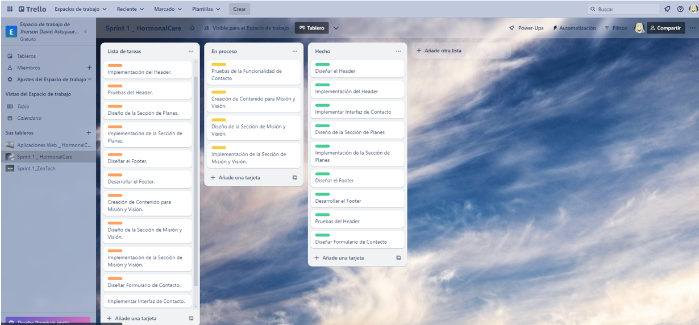

# Universidad Peruana de Ciencias Aplicadas

Ingeniería de Software

Ciclo 2024-01

# 
Desarrollo de Aplicaciones Open Source

## TF1 REPORT

**Sección:** SW51

**Profesor**: Angel Augusto Velasquez Nuñez

**StartUp Name**: NinjaCode

**Producto**: 

### Team Members:

| Member                            |    Code    |
| :-------------------------------- | :--------: |
| Claudio Sandro Quispesivana Torres| U202215099 |
| Jherson David Astuyauri Calderon  | U202218451 |
| Estefano Sebastian Lostaunau Pereira | U202211742 |
| Chinchihualpa Saldarriaga Luis Sebastian | U202212112 |
| Sebastian Valente Lobato Pozo | U202215312 |

 

### 5.2.	Landing Page, Services & Applications Implementation.

#### 5.2.1.   Sprint 1

##### 5.2.1.1. Sprint Planning 1.
|Sprint #|Sprint 1|
| - | - |
|**Sprint Planning Background**||
|Date|2024-04-04|
|Time|9:00|
|Location|Reunión realizada mediante Discord|
|Prepared By|Astuyauri Calderon Jherson David|
|Attendees (to planning meeting)|Astuyauri Calderon Jherson David / Chinchihualpa Saldarriaga Luis Sebastian/Hernan Emilio Morales Calderon/Lostaunau Pereira Estéfano Sebastián	/Quispesivana Torres Claudio Sandro|
|**Sprint Goal & User Stories**||
|Sprint 1 Goal|Organizar las secciones asignadas a cada uno para implementar la Landing Page.|
|Sprint 1 Velocity|15|
|Sum of Story Points|13|

#### 5.2.1.2. Sprint Backlog 1.
#### En el primer sprint de nuestra aplicación "HormonalCare", nos centraremos en la implementación de la Landing Page. Esta página será la primera impresión para nuestros potenciales usuarios, comunicando las funcionalidades que ofrecemos, los planes, etc. A través de un diseño cuidadoso y contenido persuasivo dirigido a nuestra audiencia objetivo.
####
<table><tr><th colspan="2" valign="top">Sprint #</th><th colspan="6" valign="top">Sprint 1</th></tr>
<tr><td colspan="2" valign="top">User Story</td><td colspan="6" valign="top">Work-Item / Task </td></tr>
<tr><td colspan="1" valign="top">Id</td><td colspan="1" valign="top">Title</td><td colspan="1" valign="top">Id</td><td colspan="1" valign="top">Title</td><td colspan="1" valign="top">Description</td><td colspan="1" valign="top">
Estimation

(Hours)
</td><td colspan="1" valign="top">Assigned To</td><td colspan="1" valign="top">Status (To-do / In Process / To-Review / Done)</td></tr>
<tr><td colspan="1" rowspan="3" valign="top">US01</td><td colspan="1" rowspan="3" valign="top">Visualización del Header.</td><td colspan="1" valign="top">T01</td><td colspan="1" valign="top">Diseñar el Header</td><td colspan="1" valign="top">Crear un diseño atractivo y funcional para el header que incluya secciones como inicio, sobre nosotros, contacto, etc.</td><td colspan="1" valign="top">Luis</td><td colspan="1" valign="top">2</td><td colspan="1" valign="top">Done</td></tr>
<tr><td colspan="1" valign="top">T02</td><td colspan="1" valign="top">Implementación del Header</td><td colspan="1" valign="top">Codificar el header basado en el diseño aprobado, utilizando HTML, CSS, y JavaScript si es necesario para interactividad.</td><td colspan="1" valign="top">Sandro</td><td colspan="1" valign="top">5</td><td colspan="1" valign="top"></td></tr>
<tr><td colspan="1" valign="top">T03</td><td colspan="1" valign="top">Pruebas del Header</td><td colspan="1" valign="top">Realizar pruebas funcionales para asegurar la correcta visualización y funcionalidad del header.</td><td colspan="1" valign="top">Jherson</td><td colspan="1" valign="top">3</td><td colspan="1" valign="top">Done</td></tr>
<tr><td colspan="1" rowspan="2" valign="top">US02</td><td colspan="1" rowspan="2" valign="top">Información sobre Planes o Suscripciones.</td><td colspan="1" valign="top">T01</td><td colspan="1" valign="top">Diseño de la Sección de Planes</td><td colspan="1" valign="top">Elaborar el diseño de la sección que detalla los planes o suscripciones disponibles, incluyendo beneficios y precios. </td><td colspan="1" valign="top">Estéfano</td><td colspan="1" valign="top">5</td><td colspan="1" valign="top">Done</td></tr>
<tr><td colspan="1" valign="top">T02</td><td colspan="1" valign="top">Implementación de la Sección de Planes</td><td colspan="1" valign="top">Codificar la sección de planes conforme al diseño, utilizando prácticas de desarrollo web responsivo para asegurar su correcta visualización en cualquier dispositivo.</td><td colspan="1" valign="top">Sebastian</td><td colspan="1" valign="top">5</td><td colspan="1" valign="top">Done</td></tr>
<tr><td colspan="1" rowspan="2" valign="top">US03</td><td colspan="1" rowspan="2" valign="top">Visualización del footer en la landing page.</td><td colspan="1" valign="top">T01</td><td colspan="1" valign="top">Diseñar el Footer</td><td colspan="1" valign="top">Crear un diseño para el footer que incluya información de contacto, enlaces rápidos a secciones relevantes, y créditos. </td><td colspan="1" valign="top">Estéfano</td><td colspan="1" valign="top">3</td><td colspan="1" valign="top">Done</td></tr>
<tr><td colspan="1" valign="top">T02</td><td colspan="1" valign="top">Desarrollar el Footer</td><td colspan="1" valign="top">Codificar el footer basándose en el diseño aprobado, utilizando tecnologías web estándar para garantizar su funcionamiento.</td><td colspan="1" valign="top">Sebastian</td><td colspan="1" valign="top">5</td><td colspan="1" valign="top">Done</td></tr>
<tr><td colspan="1" rowspan="3" valign="top">US04</td><td colspan="1" rowspan="3" valign="top">Conocer la misión y visión de la aplicación.</td><td colspan="1" valign="top">T01</td><td colspan="1" valign="top">Creación de Contenido para Misión y Visión.</td><td colspan="1" valign="top">Desarrollar el contenido textual que describe la misión, visión y valores de la empresa para ser incluidos en la landing page. </td><td colspan="1" valign="top">Jherson</td><td colspan="1" valign="top">2</td><td colspan="1" valign="top">Done</td></tr>
<tr><td colspan="1" valign="top">
T02

</td><td colspan="1" valign="top">Diseño de la Sección de Misión y Visión.</td><td colspan="1" valign="top">Diseñar una sección en la landing page que presente de manera atractiva la misión y visión de la empresa.</td><td colspan="1" valign="top">Sandro</td><td colspan="1" valign="top">3</td><td colspan="1" valign="top"></td></tr>
<tr><td colspan="1" valign="top">T03</td><td colspan="1" valign="top">Implementación de la Sección de Misión y Visión.</td><td colspan="1" valign="top">Codificar la sección de misión y visión en la página, utilizando el contenido y diseño aprobados. </td><td colspan="1" valign="top">Estéfano</td><td colspan="1" valign="top">5</td><td colspan="1" valign="top">Done</td></tr>
<tr><td colspan="1" rowspan="3" valign="top">US05</td><td colspan="1" rowspan="3" valign="top">Comunicación directa con el equipo de soporte.</td><td colspan="1" valign="top">T01</td><td colspan="1" valign="top">Diseñar Formulario de Contacto</td><td colspan="1" valign="top">Crear un diseño para un formulario de contacto o chat en vivo que permita a los visitantes enviar mensajes directos al equipo de soporte. </td><td colspan="1" valign="top">Sebastian</td><td colspan="1" valign="top">3</td><td colspan="1" valign="top">Done</td></tr>
<tr><td colspan="1" valign="top">T02</td><td colspan="1" valign="top">Implementar Interfaz de Contacto</td><td colspan="1" valign="top">Implementar la interfaz de contacto en la página.</td><td colspan="1" valign="top">Jherson</td><td colspan="1" valign="top">5</td><td colspan="1" valign="top"></td></tr>
<tr><td colspan="1" valign="top">T03</td><td colspan="1" valign="top">Pruebas de la Funcionalidad de Contacto</td><td colspan="1" valign="top">Realizar pruebas para asegurar que la funcionalidad de contacto funcione correctamente, los mensajes se envíen al equipo de soporte, y que toda la información se maneje de forma segura.</td><td colspan="1" valign="top">Luis</td><td colspan="1" valign="top">2</td><td colspan="1" valign="top">Done</td></tr>
</table>

Además, se incluye en la herramienta recomendada que es Trello.

#### Enlace: <https://trello.com/invite/b/H8Ifc2ko/ATTIf05ba6e9b91d336c0560f121fd1002790D3D9927/sprint-1-hormonalcare>
####
#### 5.2.1.3. Development Evidence for Sprint Review.
####
En cuanto a los avances de la implementación de nuestro primer sprint, se puede observar que varias tareas han sido resueltas. Como, la creación del header, footer y algunas secciones tales como suscripciones, funcionalidades, acerca del equipo, formulario de contacto, entre otras secciones y características que se han desarrollado para lograr entregar en esta primera fecha nuestro producto mínimo viable (MVP).

|Repository|Branch|Commit Id|Commit Message|Commit Message Body|Commited on (Date)|
| - | - | - | - | - | - |
|LandingPageAppWeb|feature/navbar-footer-styles (then develop)|9f63be8|feature: navbar, footer y styles||11/04/23|
|LandingPageAppWeb|feature/hero-application|d92b8d4|feature: hero y application||11/04/23|
|LandingPageAppWeb|feature/services|3ea75ac|feature: services||11/04/23|
|LandingPageAppWeb|feature/about|6a7cee5|feature: about||11/04/23|
|LandingPageAppWeb|feature/subscription|91c2d4d|feature: subscription||11/04/23|

###### 5.2.1.4. Testing Suite Evidence for Sprint Review.
Para esta entrega, no se implementó el conjunto de apartados relacionados con Web Services, ya que el desarrollo se hizo en base al Landing Page.
		5.2.1.5. Execution Evidence for Sprint Review.
Video enseñando la landing page
Link al video: 
###### 5.2.1.6. Services Documentation Evidence for Sprint Review.

Este primer Sprint solo trata la implementación del landing page, por lo que no se empleó ningún servicio adicional.

###### 5.2.1.7. Software Deployment Evidence for Sprint Review.

###### 5.2.1.8. Team Collaboration Insights during Sprint.

# **CONCLUSIONES Y RECOMENDACIONES**

•	Nuestro equipo de NinjaCode ha logrado desarrollar una solución tecnológica innovadora, HormonalCare, que aborda los desafíos críticos en el seguimiento médico de enfermedades hormonales en el Perú. Hemos colaborado estrechamente para diseñar y desarrollar una aplicación que permita una gestión eficiente de registros médicos, seguimiento remoto de niveles hormonales y una comunicación efectiva entre pacientes y profesionales de la salud.

•	A lo largo de este proyecto, hemos enfrentado desafíos significativos, desde la escasez de recursos tecnológicos hasta la competencia en el mercado de la salud digital. Sin embargo, nuestra determinación y compromiso nos han permitido superar obstáculos y seguir adelante.

•	El proyecto de NinjaCode tiene objetivos claros, incluida la optimización de los seguimientos médicos, la reducción de los tiempos de espera y la mejora de la adherencia al tratamiento. Estos objetivos están respaldados por una profunda comprensión de la problemática actual en el sistema de atención médica peruano y una visión innovadora para implementar soluciones tecnológicas efectivas.

•	La aplicación HormonalCare representa un avance significativo en la integración de tecnología digital en el campo de la salud. Desde la gestión eficiente de registros médicos hasta la facilitación de videoconsultas y la comunicación fluida entre pacientes y profesionales de la salud, esta innovación promete revolucionar la forma en que se realiza el seguimiento médico de enfermedades hormonales.

