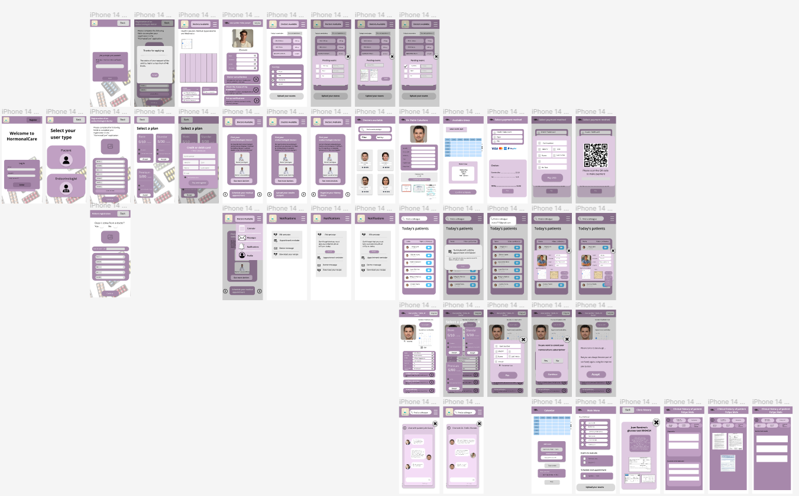

## CÁPITULO IV: PRODUCT DESIGN

### 4.1. Style Guidelines.

En esta sección presentaremos los diversos elementos que hemos seleccionado para la aplicación y página web de nuestro producto. Estos han sido escogidos no únicamente para brindarles una interfaz estética y práctica a nuestros usuarios, sino también para poder transmitirles a nuestros usuarios las emociones y valores positivos que deseamos lograr mediante los recursos visuales empleados.

#### 4.1.1. General Style Guidelines. 

**Colors:**
Para nuestra paleta de colores inicial hemos decidido emplear una escala de lilas de tono pastel. El motivo es porque son tonos suaves, que son gentiles a la vista y que además serán capaces de transmitir y producir al usuario una sensación de tranquilidad, sobre todo a quienes recién debutan con alguna enfermedad.

**Tipografía:**

**Escala**

Base: 16px

Tipografía: Open-Sans

interlineado:1,15

**Peso**

Light

Regular 

Medium

SemiBold

Bold

ExtraBold

Black

**Nomenclatura**

**Branding:**

El logo de la aplicación "Hormonal Care" combina colores azul, verde y blanco, y una tipografía sans-serif para transmitir confianza, profesionalidad y accesibilidad a médicos y pacientes. El nombre es claro, conciso y describe el objetivo de la aplicación. El logo busca crear una imagen familiar y confiable, similar a otras aplicaciones de salud.

#### 4.1.2. Web Style GUidelines.

**Colores:** En HormonalCare, elegimos colores que reflejan la tranquilidad. Malva, lavanda y azules para calma, verde para conexión con la naturaleza y marrón para estabilidad. Nuestros estilos de letra transmiten seriedad y vitalidad, creando un entorno que fomenta la paz interior y la claridad mental en tu práctica de mindfulness y meditación.

**Tipografía (Desktop):** Estos tamaños y estilos de fuente han sido elegidos para maximizar la legibilidad y la coherencia en toda la plataforma. Creemos que esta combinación de diseño visual y tipografía proporciona un ambiente propicio para tu práctica de mindfulness y meditación en línea.

**Botones:**

La aplicación "Hormonal Care" presenta botones con diferentes funciones, como pagar, aceptar, cancelar, enviar, ver historia clínica, próxima cita, etc. Estos botones están diseñados para facilitar la navegación y el uso de la aplicación, con colores, tipografía y etiquetas claras para una mejor experiencia de usuario.

**Íconos:**

### 4.2. Information Architecture.

#### 4.2.1.   Organization Systems.

Para el desarrollo de la aplicación "HormonalCare", estableceremos primero las definiciones de los requisitos y objetivos, identificando las necesidades de los pacientes y médicos, así como estableciendo metas claras. Luego, se procede al diseño de la arquitectura, planificando tanto el frontend como el backend de la aplicación, y diseñando la estructura de la base de datos correspondiente. Posteriormente, se avanza con el desarrollo del backend, implementando la lógica de negocio y asegurando la seguridad de los datos. Simultáneamente, se trabaja en el desarrollo del frontend, creando una interfaz de usuario intuitiva y funcional. Se prioriza la implementación de funcionalidades clave, tales como herramientas para seguimiento médico y telemedicina. Una vez completado el desarrollo, se procede a realizar pruebas exhaustivas y ajustes según el feedback recibido. 

#### 4.2.2.   Labeling Systems.

#### Landing Page
| Etiqueta | Descripcion | 
|----------|----------|
| Features | En esta etiqueta se muestran todas las funcionalidades y características de nuestra aplicación.    | 
| Pricing     | En este apartado, se muestran cuáles son los planes que nuestra aplicación maneja, se muestran sus precios y características.    | 
| Contact Us     | Esta etiqueta, se muestra el interfaz de inicio de sesión para que el usuario pueda ingresar a la aplicación.   |

#### Aplicación
| Etiqueta | Descripcion | 
|----------|----------|
| Perfil del usuario  | Esta etiqueta proporciona acceso al perfil personal, donde pueden ver y editar su información personal, así     | 
| Notificaciones y Recordatorios      | En esta etiqueta se encuentran las notificaciones importantes para los pacientes, como recordatorios de citas médicas, alertas de medicación y avisos sobre cambios en el tratamiento.     | 
| Inicio      | En esta etiqueta, se muestra la interfaz principal del usuario, de forma customizada, para atender sus necesidades dependiendo de que tipo de usuario sea. Esta etiqueta se muestra al iniciar sesión.    |
| Medicos disponibles       | En esta sección se muestra los médicos disponibles para el usuario paciente.     |
| Calendario        | En esta sección se muestra un calendario con la información relevante personalizada para cada tipo de usuario.      |
| Mensajes         | En esta sección se muestran los mensajes entre los usuarios de la aplicación.      |

#### 4.2.3.   SEO Tags and Meta Tags.

A continuación, se mostrarán las etiquetas que representan el contenido que se va a mostrar en nuestra aplicación web, como en nuestra landing page. De esta manera, se podrá encontrar a HormonalCare en los buscadores. 

**Sitio web estatico**: 

Title: HormonalCare 

Description: HormonalCare – NinjaCode Oficial Landing Page 

Keywords: selfcare, medical, tracking, telemedicine, hormonaldisorder 

Authors: NinjaCode 

**Aplicacion web**: 

Title: HormonalCare 

Description: HormonalCare – NinjaCode Oficial Web Site 

Keywords: selfcare, medical, tracking, telemedicine, hormonaldisorder

Authors: NinjaCode 

#### 4.2.4.   Searching Systems.

Para HormonalCare, un sistema de búsqueda podría permitir a médicos y pacientes encontrar rápidamente información relevante dentro de la aplicación. En el contexto de nuestro proyecto, contamos con dos diferentes métodos de búsqueda por tipo de usuario, estos son: 

**Usuario Paciente:** 

Búsqueda de médicos disponibles: Los usuarios de tipo paciente, podrán buscar diferentes médicos que, atiendan a sus necesidades y preferencias, mediante el uso de filtros como: Rangos de precio, género y subespecialidades. 

Calendario: El usuario podrá realizar una búsqueda de cuando tiene reunión, tomar su medicación o exámenes pendientes, mediante un filtrado de estos, el usuario podra seleccionar cuales quiere que se muestren en su calendario. 

**Usuario Medico:** 

Búsqueda de colegas: El medico podrá buscar colegas mediante una barra de búsqueda, introduciendo su correo electrónico o nombre. 

Búsqueda de pacientes: Cuando se encuentre en su perfil principal, el médico mediante una barra de búsqueda, podrá buscar a sus pacientes de su portafolio mediante su nombre o correo electrónico. 

Mensajería: El usuario podrá realizar la búsqueda de sus diferentes pacientes o colegas mediante la selección de estos por botones, donde se muestran sus nombres. 

Información clínica: Al acceder a la información clínica del paciente, el medico podrá filtrar su información accediendo a diferentes interfaces donde se almacenan información del paciente. Esta información se accede mediante botones. 

#### 4.2.5.   Navigation Systems.

HormonalCare ha sido diseñado con un sistema de navegación intuitivo y claro para facilitar la experiencia del usuario. Los usuarios pueden explorar fácilmente las distintas secciones de la aplicación mediante un menú de navegación ubicado en la parte superior de la interfaz.  

### 4.3. Landing Page UI Design.
#### 4.3.1. Landing Page Wireframe.
Los wireframes de la landing page se considero lo siguiente.

Encabezado:

Slider de los beneficios:

Sección de los precios:

Sección de contacto:

Sección de About us:

Pie de página:

Para un navegador web en mobile.
Encabezado:

Slider de los beneficios:

Slider de los precios:

Sección de contacto:

Sección de About us:

Pie de página:

#### 4.3.2. Landing Page Mock-up. V1.0
Para el diseño Mock-up version 1.0 de la landing page se considero lo siguiente.

Encabezado:

Slider de los beneficios:

Slider de los precios:

Sección de contacto:

Sección de About us:

Pie de página:

Para el diseño Mock-up version 1.0 mobile se considero lo siguiente.

Encabezado:

Slider de los beneficios:

Slider de los precios:

Sección de contacto:

Sección de About us:

Pie de página:

### 4.4.      Web Applications UX/UI Design.

#### 4.4.1.   Web Applications Wireframes.

Enlace: [https://www.figma.com/file/mNslBv5s2hX1S8Yc1M25gV/Minimal-Wireframe-Kit-(Community)?type=design&node-id=16-1451&mode=design](https://www.figma.com/file/mNslBv5s2hX1S8Yc1M25gV/Minimal-Wireframe-Kit-(Community)?type=design&node-id=16-1451&mode=design)

#### 4.4.2.   Web Applications Wireflow Diagrams.

Enlace: [https://lucid.app/lucidchart/81746e82-7355-4883-af97-39e90c1214e8/edit?viewport_loc=-30442%2C5295%2C129066%2C44793%2C0_0&invitationId=inv_5a5a8229-a89a-422f-b095-b21994fcc49a](https://lucid.app/lucidchart/81746e82-7355-4883-af97-39e90c1214e8/edit?viewport_loc=-30442%2C5295%2C129066%2C44793%2C0_0&invitationId=inv_5a5a8229-a89a-422f-b095-b21994fcc49a)

#### 4.4.3.   Web Applications Mock-ups.

Figma Mock ups: [https://www.figma.com/file/5bhJ7aAWlbKHEJgjVZ8Gfc/ninjacode?type=design&node-id=0%3A1&mode=design&t=HeYuEY53eyYW4R5A-1](https://www.figma.com/file/5bhJ7aAWlbKHEJgjVZ8Gfc/ninjacode?type=design&node-id=0%3A1&mode=design&t=HeYuEY53eyYW4R5A-1)

#### 4.4.4.   Web Applications User Flow Diagrams.

User 1: Médico endocrinólogo desea registrarse por primera vez en HormonalCare.

User goal: Seleccionar el apartado de registro como médico endocrinólogo, luego ingresar sus datos personales y adjunta los documentos que validen su cargo como especialista.

Enlace: [https://lucid.app/lucidchart/81746e82-7355-4883-af97-39e90c1214e8/edit?viewport_loc=-4299%2C9238%2C5712%2C2663%2C0_0&invitationId=inv_5a5a8229-a89a-422f-b095-b21994fcc49a](https://lucid.app/lucidchart/81746e82-7355-4883-af97-39e90c1214e8/edit?viewport_loc=-4299%2C9238%2C5712%2C2663%2C0_0&invitationId=inv_5a5a8229-a89a-422f-b095-b21994fcc49a)

User 2: Paciente desea registrarse por primera vez en HormonalCare.

User goal: Seleccionar el apartado de registro como paciente, luego indicar si viene de parte de algún médico, caso sea “Si”, deberá ingresar el código que el médico le habrá proporcionado desde su perfil de médico, caso sea “No”, podrá continuar sin llenar el apartado de código de médico, e ingresará sus datos personales para crear su perfil de paciente.

Enlace: [https://lucid.app/lucidchart/81746e82-7355-4883-af97-39e90c1214e8/edit?viewport_loc=-4299%2C9238%2C5712%2C2663%2C0_0&invitationId=inv_5a5a8229-a89a-422f-b095-b21994fcc49a](https://lucid.app/lucidchart/81746e82-7355-4883-af97-39e90c1214e8/edit?viewport_loc=-4299%2C9238%2C5712%2C2663%2C0_0&invitationId=inv_5a5a8229-a89a-422f-b095-b21994fcc49a)

### 4.5.      Web Applications Prototyping.

#### Prototipos de UI para Desktop:

#### Prototipos de UI para Mobile Web Browser:

Link: [https://www.figma.com/file/5bhJ7aAWlbKHEJgjVZ8Gfc/ninjacode?type=design&node-id=0%3A1&mode=design&t=HeYuEY53eyYW4R5A-1](https://www.figma.com/file/5bhJ7aAWlbKHEJgjVZ8Gfc/ninjacode?type=design&node-id=0%3A1&mode=design&t=HeYuEY53eyYW4R5A-1)

### 4.6.      Domain-Driven Software Architecture.
#### 4.6.1.   Software Architecture Context Diagram.
**Diagrama de contexto:**

[https://structurizr.com/review/53553f42-3e09-4c86-adac-c1eb6cfb5546](https://structurizr.com/review/53553f42-3e09-4c86-adac-c1eb6cfb5546)

#### 4.6.2.   Software Architecture Container Diagrams.
**Diagrama de contenedores:**

[https://structurizr.com/review/5a6b535a-2205-4553-ad65-540b1447b3e1](https://structurizr.com/review/5a6b535a-2205-4553-ad65-540b1447b3e1)

#### 4.6.3.   Software Architecture Components Diagrams.
**API REST component diagram:**

[https://structurizr.com/review/9f3a4b24-fa1f-4eca-849f-fad6fb9c4823](https://structurizr.com/review/9f3a4b24-fa1f-4eca-849f-fad6fb9c4823 )

**Medical Appointment BC Component Diagram:**

[https://structurizr.com/review/fda0c708-4e86-43d5-ac76-086b20a0f82b](https://structurizr.com/review/fda0c708-4e86-43d5-ac76-086b20a0f82b)

**Calendar BC Component Diagram:**

[https://structurizr.com/review/d51cf89a-ed30-4c9c-8a2f-609c81a902d3](https://structurizr.com/review/d51cf89a-ed30-4c9c-8a2f-609c81a902d3)

**Treatment BC Component Diagram:**

[https://structurizr.com/review/f060fa7a-2d88-43da-b738-1041950adfbc](https://structurizr.com/review/f060fa7a-2d88-43da-b738-1041950adfbc)

**Medication BC Component Diagram:**

[https://structurizr.com/review/6f49bad3-8b77-42b6-bd1f-5bda48e6136e](https://structurizr.com/review/6f49bad3-8b77-42b6-bd1f-5bda48e6136e)

**History Medical BC Component Diagram:**

[https://structurizr.com/review/620c16a6-df93-409c-a657-0efb2572a59c](https://structurizr.com/review/620c16a6-df93-409c-a657-0efb2572a59c)

**Notification BC Component Diagram:**

[https://structurizr.com/review/79b22862-a261-4dd5-a5de-766efe361ce8](https://structurizr.com/review/79b22862-a261-4dd5-a5de-766efe361ce8)

**Chat BC Component Diagram:**

[https://structurizr.com/review/27e55206-64bd-40b0-a8a0-a79388c9a7f0](https://structurizr.com/review/27e55206-64bd-40b0-a8a0-a79388c9a7f0)

**Patient Management BC Component Diagram:**

[https://structurizr.com/review/123c8a5d-0e2b-445b-8a79-a140039af699](https://structurizr.com/review/123c8a5d-0e2b-445b-8a79-a140039af699)

**Medical Management BC Component Diagram:**

[https://structurizr.com/review/505f0f0e-5694-4648-a0ba-37bc224de25f](https://structurizr.com/review/505f0f0e-5694-4648-a0ba-37bc224de25f)

**Subscription BC Component Diagram:**

[https://structurizr.com/review/f8e919ff-b38c-4a55-81ec-c5e5850a6e12](https://structurizr.com/review/f8e919ff-b38c-4a55-81ec-c5e5850a6e12)

**Payment BC Component Diagram:**

[https://structurizr.com/review/b5241bc0-f716-4559-bb92-a1c4a5d40bfd](https://structurizr.com/review/b5241bc0-f716-4559-bb92-a1c4a5d40bfd)

**Search BC Component Diagram:**

[https://structurizr.com/review/5da99437-c234-4427-9107-c32b474e106e](https://structurizr.com/review/5da99437-c234-4427-9107-c32b474e106e)

**Safety BC Component Diagram:**

[https://structurizr.com/review/a549b9b4-3bc1-4d12-9b6e-46243279adef](https://structurizr.com/review/a549b9b4-3bc1-4d12-9b6e-46243279adef)

## 4.7.      Software Object-Oriented Design.
### 4.7.1.   Class Diagrams.

Link: [https://lucid.app/lucidchart/abe981e7-1c29-4d33-af25-1a2ba48c3300/edit?viewport_loc=-7598%2C-884%2C3976%2C2123%2C0_0&invitationId=inv_34e168e9-90db-4b20-9ca7-1c81ca7a0310](https://lucid.app/lucidchart/abe981e7-1c29-4d33-af25-1a2ba48c3300/edit?viewport_loc=-7598%2C-884%2C3976%2C2123%2C0_0&invitationId=inv_34e168e9-90db-4b20-9ca7-1c81ca7a0310)
### 4.7.2.   Class Dictionary.

|Class|Description|
| :- | :- |
|Doctor|La clase Doctor representa a los médicos especializados en endocrinología que utilizan la aplicación "HormonalCare". Los doctores pueden acceder a la plataforma para gestionar el tratamiento de pacientes, programar citas, revisar registros médicos y comunicarse con otros médicos y pacientes. |
|Usuario|La clase User representa a los usuarios de la aplicación "HormonalCare". Esta clase encapsula las características y comportamientos comunes compartidos tanto por los pacientes como por los médicos dentro del sistema.|
|
Paciente

|Esta clase representa a los pacientes dentro del sistema de la aplicación "HormonalCare". Esta clase hereda de la clase Usuario y agrega propiedades y métodos específicos para gestionar la información y las interacciones relacionadas con los pacientes.|
|Solicitud|En esta clase están las solicitudes realizadas por los pacientes dentro de la aplicación. Esta clase almacena información detallada sobre cada solicitud, incluyendo el, la fecha y hora solicitadas para la cita, el motivo de la cita médica, el estado actual de la solicitud, etc. |
|Calendario|Esta clase proporciona funcionalidades para gestionar citas médicas y eventos dentro de la aplicación. Esta clase permite la programación, visualización y gestión de eventos relacionados con la atención médica de los pacientes.|
|Enfermedad|Esta clase representa diferentes tipos de enfermedades, como gripe, diabetes o hipertensión. Cada enfermedad tiene un identificador único y un nombre. Las consultas médicas están relacionadas con las enfermedades, lo que significa que cuando visitas al médico por una enfermedad, se registra esa enfermedad.|
|Resultado|Esta clase maneja los resultados de tus exámenes médicos, como análisis de sangre o radiografías. Cada resultado tiene un número único, una fecha y el resultado del examen. Los resultados están relacionados con tus consultas médicas. Cuenta con la opción de poder ver el resultado y agregarlo.|
|Laboratorio|Aquí se registran los laboratorios médicos donde se realizan tus exámenes. Cada laboratorio tiene un número identificador y un nombre. Los resultados de exámenes provienen de estos laboratorios.	|
|Tratamiento|Representa los tratamientos que recibes para una enfermedad. Por ejemplo, si te diagnostican diabetes, el tratamiento podría incluir cambios en la dieta y medicamentos. Cada tratamiento tiene un número único y un tipo. Se puede registrar los tratamientos que el medico vea conveniente.|
|Medicamento|Aquí se incluyen los medicamentos que forman parte de tu tratamiento. Cada medicamento tiene un número identificador, un nombre genérico y una marca. Los medicamentos están asociados con los tratamientos que recibes y pueden registrarse dependiendo de las necesidades del doctor.|
|Recordatorio|La clase Recordatorio gestiona recordatorios dentro del sistema. Contiene un identificador único y un contenido descriptivo que especifica la tarea o evento a recordar. Ofrece funcionalidades para configurar y recibir notificaciones de recordatorios.|
|Mensaje|Esta clase representa los mensajes enviados dentro de la aplicación. Cada mensaje tiene un identificador único, un contenido de texto y una fecha y hora de envío. Permite enviar mensajes entre usuarios y mantener un registro de comunicaciones.|
|Chat|Aquí se organiza las conversaciones entre usuarios en la aplicación. Tiene un identificador único que representa cada chat y puede contener múltiples mensajes. Proporciona métodos para gestionar y enviar mensajes en tiempo real entre participantes.|
|Consulta\_Medica|La clase Consulta\_Medica registra consultas médicas realizadas en la aplicación. Cada consulta tiene un identificador único y una fecha asociada. Esta clase permite mostrar información relevante sobre la consulta y agregar detalles adicionales sobre el encuentro médico.|
|Receta|Aquí se maneja las recetas médicas generadas para los pacientes. Incluye información como el tipo de receta, el nombre, el precio y los beneficios asociados. Permite ver, registrar y eliminar recetas médicas dentro del sistema.|
|Recordatorio\_Medicacion|La clase Recordatorio\_Medicacion administra los recordatorios relacionados con la medicación de los pacientes. Contiene detalles como los días de recordatorio, la frecuencia diaria y las indicaciones. Ofrece funcionalidades para registrar recordatorios y enviar notificaciones relacionadas con la medicación.|
|Suscripcion|La clase Suscripcion gestiona las suscripciones de los usuarios a planes dentro de la aplicación. Almacena detalles como la fecha de inicio y finalización de la suscripción. Proporciona métodos para ver, elegir, cambiar y cancelar planes de suscripción.|
|Tipo\_Suscripcion|Tipo\_Suscripcion define los diferentes tipos de planes de suscripción disponibles en la aplicación. Cada tipo tiene un identificador único, un nombre, un precio y beneficios asociados. Esta clase facilita la gestión y visualización de los planes de suscripción.|
|Pago|La clase Pago registra los pagos realizados por los usuarios dentro del sistema. Contiene un identificador único, un precio y un código QR asociado al pago. Permite realizar y gestionar transacciones de pago en la aplicación.|
|Tarjeta|Aquí se representa la información de la tarjeta de crédito utilizada para pagos dentro del sistema. Incluye detalles como el nombre del titular, número de tarjeta, fecha de caducidad y número de seguridad. Esta clase facilita el manejo de datos de tarjetas para realizar transacciones.|
|Yape|La clase Yape maneja las transacciones realizadas a través del servicio de pagos Yape. Contiene un identificador único de transacción y un código de transacción asociado. Proporciona métodos para gestionar y visualizar datos relacionados con transacciones Yape.|
|Plin|Esta clase gestiona las transacciones realizadas a través del servicio de pagos Plin. Almacena un identificador único de transacción y un código asociado. Ofrece funcionalidades para manejar y consultar datos de transacciones Plin en la aplicación.|

## 4.8.      Database Design.
### 4.8.1.   Database Diagram.

Link: [https://upcedupe-my.sharepoint.com/:b:/g/personal/u202211742_upc_edu_pe/ERqeXmr72tpJsapVhOFRtwUBSZTw8gd5x9iD1lB0_XhtLw?e=lFrKWs](https://upcedupe-my.sharepoint.com/:b:/g/personal/u202211742_upc_edu_pe/ERqeXmr72tpJsapVhOFRtwUBSZTw8gd5x9iD1lB0_XhtLw?e=lFrKWs)
