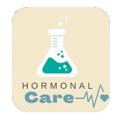
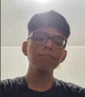
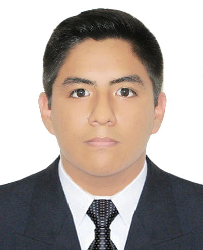
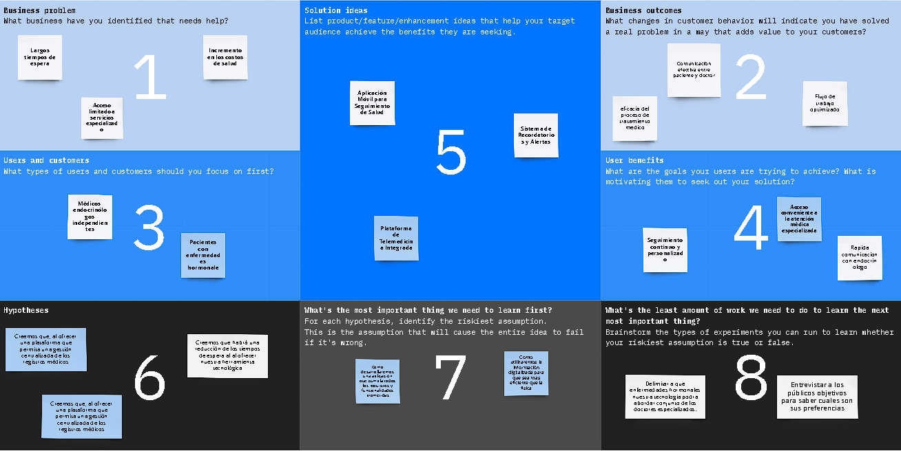

# Universidad Peruana de Ciencias Aplicadas

Ingeniería de Software

Ciclo 2024-01

# 
Desarrollo de Aplicaciones Open Source

## TF1 REPORT

**Sección:** SW51

**Profesor**: Angel Augusto Velasquez Nuñez

**StartUp Name**: NinjaCode

**Producto**: HormonalCare

### Team Members:

| Member                            |    Code    |
| :-------------------------------- | :--------: |
| Claudio Sandro Quispesivana Torres| U202215099 |
| Jherson David Astuyauri Calderon  | U202218451 |
| Estefano Sebastian Lostaunau Pereira | U202211742 |
| Chinchihualpa Saldarriaga Luis Sebastian | U202212112 |
| Sebastian Valente Lobato Pozo | U202215312 |

 

### 1.1. Startup Profile
#### 1.1.1.Descripción de la Startup

NinjaCode es un startup compuesto por estudiantes de la Facultad de Ingeniería y Ciencias de la Universidad Peruana de Ciencias Aplicadas (UPC), dedicados a optimizar los seguimientos médicos. Nuestra visión es abordar los desafíos existentes en el sistema de atención médica peruano, especialmente en el seguimiento de enfermedades hormonales.
En el Perú, el sistema de atención médica para pacientes diagnosticados con enfermedades hormonales enfrenta desafíos significativos. La simplicidad del sistema se ve opacada por su falta de eficiencia, tanto para los médicos como para los pacientes. Esta ineficiencia se agudiza en los centros de salud estatales, donde la demanda supera ampliamente la capacidad de atención. Es en este escenario donde NinjaCode ha intervenido desarrollando soluciones tecnológicas que agilizan los tratamientos y optimizan los recursos disponibles en todas las regiones del Perú.
Nuestro enfoque se centra en la comunicación, seguridad y gestión eficiente de los datos de nuestros usuarios. La aplicación HormonalCare, desarrollada por NinjaCode, proporciona una experiencia de navegación óptima para el seguimiento médico de enfermedades hormonales en el Perú. Con HormonalCare, buscamos revolucionar la forma en que se realizan los seguimientos médicos, brindando una plataforma tecnológica segura, intuitiva y eficiente que permite a los pacientes y profesionales de la salud gestionar y monitorear enfermedades hormonales de manera efectiva.

Nuestra misión es simple pero poderosa: transformar la forma en que se realizan los seguimientos médicos, mejorando la calidad de vida de millones de personas en todo el mundo. Aspiramos a liderar la industria de la salud digital, siendo reconocidos por nuestra innovadora aplicación HormonalCare. Nos esforzamos por establecer estándares de excelencia en seguridad de datos, conectividad y experiencia de usuario en el campo del seguimiento médico de enfermedades hormonales.

Logo del Startup:

Logo del Producto:

#### 1.1.2. Perfiles de integrantes del equipo
|                             |                                                              |
|-----------------------------|--------------------------------------------------------------|
| **JHERSON DAVID ASTUYAURI CALDERÓN** |                                                     |
| **INGENIERIA DE SOFTWARE**  |                                                              |
| **U202218451**              |                                                              |
| Qué tal, soy Jherson Astuyauri. Tengo 19 años, curso el quinto ciclo de la carrera de Ingeniería de Software. Escogí la carrera porque me interesan los efectos de la tecnología en la vida de las personas. Ahora mismo me gusta la inteligencia artificial, jugar videojuegos, ver series de anime, nadar y aprender sobre finanzas. Mis conocimientos técnicos con los que puedo contribuir al equipo son los que he adquirido a lo largo de mi estancia en la universidad. Además, considero que tengo una actitud proactiva y responsabilidad para cumplir con las tareas.  | 

|                             |                                                              |
|-----------------------------|--------------------------------------------------------------|
| **CLAUDIO SANDRO QUISPESIVANA TORRES** |                                                     |
| **INGENIERIA DE SOFTWARE**  |                                                              |
| **U202215099**              |                                                              |
| Buenas, soy Sandro Quispesivana. Tengo 19 años, actualmente estoy cursando el quinto ciclo de la carrera de Ingeniería de Software. Podría decir que los conocimientos que mejor se me dan son la programación orientada a objetos para muchos tipos de lenguajes, mi agilidad en la creación de base de datos, el uso de herramientas para el desarrollo de FrontEnd como lo puede ser HTML, CSS y un poco de JavaScript, y capaz mi enfoque empresarial de querer nutrir en una gran variedad de mercados y marcar un antes y un después. Las habilidades que me más me representan son la responsabilidad y el ingenio que me nace en problemas serios.| 

|                             |                                                              |
|-----------------------------|--------------------------------------------------------------|
| **LUIS SEBASTIAN CHINCHIHUALPA SALDARRIAGA** |                                                  |
| **INGENIERIA DE SOFTWARE**  |                                                              |
| **U202212112**              |                                                              |
| Soy estudiante de la carrera de Ingeniería de Software en la Universidad Peruana de Ciencias Aplicadas y actualmente estoy cursando el quinto ciclo. Sé programar en C++, Java y un poco de Python. Me considero una persona muy responsable, exigente y trabajadora. En el grupo del proyecto puedo aportar con mis conocimientos adquiridos en los cursos de Especificación y Análisis de Requerimientos, Algoritmos y Estructuras de Datos y Diseño y Patrones de Software.  | 

|                             |                                                              |
|-----------------------------|--------------------------------------------------------------|
| **ESTÉFANO SEBASTIÁN LOSTAUNAU PEREIRA** |                                                     |
| **INGENIERIA DE SOFTWARE**  |                                                              |
| **U202211742**              |                                                              |
| Hola, soy Estéfano Lostaunau. Tengo 19 años, actualmente curso el quinto ciclo de la carrera de Ingeniería de Software. Estudié esta carrera por sus diversos enfoques con los que cuenta. Me gusta la programación y se programar en C++, Python y WEB. Mis conocimientos contribuirán al equipo para desarrollar las actividades propuestas. Me considero una persona responsable, colaborativa y perfeccionista.  |

|                             |                                                              |
|-----------------------------|--------------------------------------------------------------|
| **SEBASTIAN VALENTE LOBATO POZO** |                                                     |
| **INGENIERIA DE SOFTWARE**  |                                                              |
| **u202215312**              |                                                              |
| Soy Sebastian Valente Lobato Pozo, tengo 19 años, estudio la carrera de Ingeniería de Software en la Universidad Peruana de Ciencias aplicadas, actualmente estoy cursando el quinto ciclo de mi carrera, Tengo conocimientos en el lenguaje de C++, Python y LUA. Las habilidades que me representan son la amabilidad, comunicación asertiva, empatía y adaptabilidad al cambio, siento que todo lo dicho, puede aportar a la elaboración del trabajo.   |
   
### 1.2. Solution Profile
   #### 1.2.1.  Antecedentes y problemática
Las enfermedades hormonales representan una creciente preocupación en el ámbito de la salud pública, impactando a personas de todas las edades y géneros. En la urbe limeña, al igual que en numerosos entornos urbanos, se enfrenta a retos significativos en la atención y seguimiento de pacientes aquejados por estas condiciones médicas. Desde la menopausia hasta el hiperandrogenismo, estas patologías demandan una atención integral, vigilancia constante y ajustes regulares en la medicación para salvaguardar el bienestar de los pacientes. La relevancia epidemiológica de las enfermedades hormonales en el Perú, la escasez de acceso oportuno a la atención especializada debido a las deficiencias del sistema de salud peruano y la escasez de médicos especializados, así como la baja adherencia al tratamiento y el incumplimiento de los objetivos terapéuticos, se suman como factores que dificultan el manejo efectivo de estas enfermedades en la población de Lima.

Los estudios realizados por Farías y Bardales (2021) sobre el conocimiento y adherencia al tratamiento en pacientes con Diabetes Mellitus tipo 2 en el Hospital Reátegui, y por Pocohuanca-Ancco, Villacorta y Hurtado-Roca (2021) sobre la no-adherencia al tratamiento antihipertensivo en pacientes de un hospital del seguro, subrayan la preocupante realidad de la baja adherencia al tratamiento en enfermedades crónicas con tasas de no-adherencia del 40% y 27% respectivamente. Estas cifras evidencian la problemática que enfrentan los médicos endocrinólogos para realizar un seguimiento adecuado a pacientes con enfermedades hormonales, la cual, en muchos casos, es de por vida. Adicionalmente cabe recalcar los largos tiempos de espera, ya que en una encuesta realizada por el INEI (2014), a nivel nacional el promedio de días que los usuarios esperan para obtener una cita es de 17 días. Asimismo en los establecimientos del Ministerio de Salud (MINSA), el promedio de tiempo es de 12 días, en el Seguro Social de Salud (EsSalud) es de 19 días, en Fuerzas Armadas y Policiales es de 21 días y en las clínicas 8 días. Por otro lado El 49,3% de los encuestados identificaron como principal problema la demora en la atención de salud, el 34,4% indicó el maltrato en la atención y el 18,1% la falta de medicamentos en las farmacias de los establecimientos de salud. 

Asimismo, las estadísticas muestran una situación preocupante: solo hay contratados en locales del Minsa unos 42 médicos especialistas para cada 100 mil ciudadanos (Minsa, 2023) y solo hay 10 médicos endocrinólogos por cada medio millón de peruanos (Manrique, 2015), mientras que el porcentaje de población de 15 años a más con obesidad, hipertensión arterial y diabetes mellitus continúa en aumento, alcanzando cifras alarmantes en el año 2020 del 24,6%, 21,7% y 4,5%, respectivamente (INEI, 2020)

En consecuencia, frente a esta problemática, nuestro grupo ha visto la oportunidad de crear una aplicación que permita una gestión eficiente y eficaz de los registros médicos, un seguimiento de los niveles hormonales y una comunicación fluida entre los profesionales de la salud involucrados en el tratamiento de pacientes con enfermedades hormonales. Esta solución tecnológica busca agilizar el proceso de ajuste de tratamientos, reducir los tiempos de espera y de traslado, además de brindar una atención más coordinada, inmediata y personalizada a los pacientes con enfermedades hormonales en la ciudad de Lima. Esta solución se plantea debido a las experiencias positivas del piloto “Teletriaje y Teleurgencias” implementado por Centro Nacional de Telemedicina – CENATE, quienes indican que lograron reducir el tiempo de espera de 4 o 5 horas a 15 minutos, además de la digitalización de las historias clínicas lo cual permite que la evaluación médica sea mucha más ágil (EsSalud, 2022) y gracias a que el acceso a Internet en el Perú ha experimentado un significativo aumento, con un 71.1% de la población conectada en el 2021, lo que sugiere una oportunidad para la implementación de soluciones tecnológicas en el ámbito de la salud (OPS, 2023).

A continuación, se evidencia la utilización del método de las 5W’s y 2H’s para detallar la problemática:

**What:** ¿Cuál es el problema?

El principal problema es el manejo deficiente de las enfermedades hormonales en la ciudad de Lima. Estas condiciones requieren un seguimiento constante, ajustes frecuentes de medicación y una atención especializada. Sin embargo, factores como la falta de acceso oportuno a médicos endocrinólogos, la baja adherencia al tratamiento, los largos tiempos de espera para obtener citas y la escasez de recursos en el sistema de salud dificultan el manejo adecuado de estas enfermedades.

**Why:** ¿Por qué es un problema?

Esta problemática es preocupante porque las enfermedades hormonales, si no se tratan de manera adecuada, pueden provocar complicaciones graves y afectar significativamente la calidad de vida de los pacientes. Según los estudios mencionados, la baja adherencia al tratamiento en enfermedades crónicas como la diabetes mellitus tipo 2 e hipertensión arterial alcanza tasas alarmantes del 40% y 27%, respectivamente. Esto aumenta el riesgo de complicaciones como resistencia a la insulina, dislipidemia, problemas cardiovasculares y renales.

**Who:** ¿Quiénes se ven involucrados en el problema?

Los principales afectados son los pacientes con enfermedades hormonales en la ciudad de Lima, quienes enfrentan dificultades para acceder a una atención médica especializada y un seguimiento adecuado de su condición. También se ven involucrados los profesionales de la salud, especialmente los endocrinólogos, quienes deben lidiar con la escasez de recursos y la falta de herramientas para realizar un seguimiento eficiente y eficaz de sus pacientes.

**Where:** ¿Dónde se produce el problema?

El problema se produce principalmente en la ciudad de Lima y, en general, en el ámbito urbano peruano. Según las estadísticas citadas, la situación es preocupante en los establecimientos del Ministerio de Salud (MINSA) y del Seguro Social de Salud (EsSalud), donde los tiempos de espera para obtener una cita médica son considerables.

**When:** ¿Cuándo se convierte en un problema?

Esta problemática se convierte en un problema crítico cuando los pacientes no reciben un diagnóstico oportuno, un tratamiento adecuado y un seguimiento continuo de su enfermedad hormonal. Esto puede ocurrir desde el mismo momento en que se manifiestan los primeros síntomas, pero se agrava con el tiempo debido a la falta de atención médica especializada y la baja adherencia al tratamiento.

**How:** ¿Cómo puede ayudar esta aplicación a abordar esta problemática?

La aplicación propuesta busca abordar esta problemática de varias maneras:

   1. Facilitando el acceso a médicos endocrinólogos y reduciendo los tiempos de espera mediante la implementación de videoconsultas y la gestión eficiente de citas médicas.

   2. Permitiendo un seguimiento continuo de los niveles hormonales, síntomas y medicación de los pacientes, lo que ayudará a los médicos a realizar ajustes oportunos en el tratamiento.

   3. Brindando información personalizada y educación sobre las enfermedades hormonales, lo que puede mejorar la adherencia al tratamiento y el empoderamiento de los pacientes.

   4. Facilitando la comunicación entre pacientes y profesionales de la salud, lo que mejorará la coordinación y la calidad de la atención.

**How much:** ¿Cuál sería el impacto al implementar esta aplicación?

La implementación de esta aplicación podría tener un impacto significativo en el manejo de las enfermedades hormonales en la ciudad de Lima y, potencialmente, en todo el Perú. Algunas de las consecuencias positivas incluyen:

   1. Mejor acceso a la atención médica especializada y reducción de los tiempos de espera, lo que permitiría un diagnóstico y tratamiento más oportunos.

   2. Mayor adherencia al tratamiento gracias al seguimiento continuo, la educación y el empoderamiento de los pacientes, lo que disminuiría el riesgo de complicaciones.

   3. Optimización de los recursos del sistema de salud al facilitar la coordinación entre profesionales y reducir la necesidad de desplazamientos físicos.

   4. Mejora en la calidad de vida de los pacientes con enfermedades hormonales al recibir una atención más personalizada y eficiente.

   5. Reducción de los costos asociados a las complicaciones y hospitalizaciones derivadas del mal manejo de estas enfermedades.

#### 1.2.2.	Lean UX Process.
   ##### 1.2.2.1.	Lean UX Problem Statements.
   
En Lima, Perú, hemos observado que las enfermedades hormonales representan un desafío de salud pública marcado por la inequidad en el acceso a servicios especializados, la escasez de médicos capacitados y la baja adherencia al tratamiento. Según Abramo et al. (2020), la falta de acceso oportuno a atención médica especializada, exacerbada por la ausencia de telemedicina y la escasez de infraestructura tecnológica, produce un aumento del riesgo de complicaciones en enfermedades crónicas. 

Esta situación se refleja en la dificultad para realizar seguimientos adecuados de enfermedades y en la falta de educación para el autocuidado de los pacientes, lo que resulta en una mayor incidencia de hospitalizaciones y un incremento en los costos de salud (Ocronos, 2023). Además, se ve agravada por los largos tiempos de espera para consultas médicas (INEI, 2014), junto con la falta de médicos endocrinólogos, como lo señala Manrique (2015). Esto en medio de un aumento alarmante en el porcentaje de población con enfermedades hormonales, según datos del INEI (2020). 

La pregunta que guía nuestro proyecto es: ¿Cómo puede una aplicación web superar las barreras tecnológicas, económicas y sociales con el fin de promover una gestión eficiente del registro, seguimiento y agilizar el proceso de tratamiento para pacientes con enfermedades hormonales en Lima, Perú?

   ##### 1.2.2.2.	Lean UX Assumptions.

Business Assumptions:
1.	Creemos que nuestros usuarios necesitan agilizar su forma de llevar tratamientos médicos hormonales a través de la telemedicina puesto que esta ha demostrado ser rentable en cuanto a costos de servicios y que ha permitido la disminución de los gastos de traslado y tiempo que tienen los pacientes.
2.	Estas necesidades se pueden satisfacer con una plataforma que permita la comunicación y consulta de datos en la cual se pueda llevar el monitoreo y el acceso a una reunión medica sin la necesidad de pactar una cita presencial, lo cual agilizaría el seguimiento y tratamiento de enfermedades hormonales.
3.	Nuestros clientes iniciales serán médicos especializados en endocrinología quienes desean que el tratamiento de sus pacientes sea lo más estable y eficaz posible. Lo que permita su agilización en tiempos de monitoreo tanto para ellos como sus pacientes.
4.	El valor más importante que un cliente quiere de nuestro servicio es la simplicidad y efectividad, puesto que los pacientes y los médicos necesitan de una comunicación constante y organizada, sin complicaciones durante el manejo de la plataforma que forma parte de la experiencia de usuario.

5.	El cliente también va a obtener diversos beneficios adicionales como la organización que la plataforma da al momento del que el paciente ingrese sus controles de su respectiva enfermedad, el poder asignar pacientes a algún miembro de su red contactos y que la información sea compartida de manera inmediata, y el poder agregar laboratorios para la realización de exámenes de control, que hará el propio paciente, y que enviará para que el medico pueda analizarlas.

6.	Vamos a obtener la mayoría de nuestros clientes por medio de los periodos de prueba que ofrece nuestra plataforma en la cual los médicos podrán experimentar con los beneficios antes de comprometerse al pago de una suscripción, y además de los descuentos por referencias como el referir a otros colegas a que suscriban a la aplicación.

7.	Vamos a obtener ingresos mediante la suscripción que pagarán los médicos especializados en endocrinología quienes desean establecer una mejor relación en el tratamiento de sus pacientes agilizando los tiempos de cada control que se requiera.

8.	Nuestra competencia en el mercado será aplicaciones de los propios centros de salud que han desarrollado para no depender de una herramienta externa para el tratamiento de estas enfermedades tal como Teleatiendo que es la plataforma de Essalud que gestiona la solicitud, registro y consulta de datos sobre los servicios de telemedicina y monitoreo.

9.	Vamos a tener ventaja frente a nuestra competencia debido a la experiencia intuitiva de navegación que se ofrece tanto a pacientes como a médicos. La interfaz de usuario está diseñada para el fácil uso, la interacción y el flujo de trabajo tanto para los médicos como para los pacientes.

10.	El mayor riesgo del servicio es la perdida de la escalabilidad si se experimenta un aumento repentino en el número de usuarios que accedan a la plataforma de manera simultánea.

11.	Lo resolveremos realizando una cuidadosa planificación y gestión de la capacidad de nuestros servidores y recursos informáticos, lo que nos permitirá ajustar dinámicamente la capacidad del sistema según la demanda.

12.	Otras suposiciones podrían incluir la adaptación de nuestra estrategia empresarial según sea necesario para responder a cambios inesperados en el entorno médico.

User Assumptions:

1.	¿Quien es el usuario?

Los médicos endocrinólogos son los principales suscriptores de nuestro servicio. Además, los pacientes son añadidos a los registros por los propios médicos sin incurrir en una suscripción. Sin embargo, los pacientes también tendrán su propia interfaz para mantener el contacto durante el tratamiento de sus enfermedades hormonales.

2.	¿Qué problemas tiene nuestro producto?

La realidad en Perú difiere considerablemente de la de los países más desarrollados. Según el INEI (2020), solo el 40,1% de los hogares peruanos cuenta con acceso a Internet. Esta situación representa una gran desventaja para los servicios de salud a distancia, como el que propone HormonalCare.

3.	¿Qué características son importantes?

Las estadísticas que respaldan el tratamiento médico y la gestión de datos de los exámenes de laboratorio ordenados por el médico responsable son fundamentales. Además, la capacidad de recuperación y transferencia de datos de manera eficiente es crucial en situaciones donde un médico decide delegar la responsabilidad de un paciente a uno de sus colegas.

4.	¿Dónde encaja nuestro producto en su trabajo o vida?

Según Castillo (2023), en áreas rurales o remotas donde la disponibilidad de servicios médicos especializados es limitada, la telemedicina ofrece la oportunidad de acceder a expertos sin la necesidad de realizar largos desplazamientos. En el sistema tradicional, los pacientes a menudo enfrentan largos tiempos de espera, a veces semanas o meses, para obtener una cita con un médico especialista, como un endocrinólogo. En este contexto, HormonalCare surge como una solución que permite a los médicos agilizar el tratamiento de sus pacientes sin requerir la presencia física, facilitando así la atención médica remota. Esto permite que los pacientes realicen sus rutinas médicas de forma autónoma, con la supervisión del médico correspondiente.

5.	¿Cuándo y cómo es nuestro producto usado?

Nuestro servicio se utiliza cuando el paciente encuentra el espacio y el tiempo adecuados para concertar una reunión con su médico y llevar a cabo un autodiagnóstico cargando las pruebas de forma organizada en la plataforma. Durante esta sesión, el paciente es monitoreado por el médico a través de una videollamada. Dependiendo de los datos proporcionados por el paciente, HormonalCare genera un análisis estadístico detallado que permite al médico examinar con mayor precisión el comportamiento y los estímulos que experimenta el paciente durante el período de seguimiento autónomo. Estos datos se almacenan en el historial clínico del paciente, al cual solo el médico asignado tiene acceso, así como cualquier colega a quien pueda delegar el seguimiento.

6.	¿Cómo debe verse nuestro producto y como debe comportarse?

Nuestro producto debe ser simple y eficaz, de modo que tanto pacientes como médicos se sientan cómodos al utilizar todas sus funcionalidades. De esta manera, buscamos asegurar que la experiencia del usuario sea lo más confortable posible durante la navegación por la aplicación.

   ##### 1.2.2.3.	Lean UX Hypothesis Statements. 

1. Creemos que, al desarrollar una aplicación que permita una gestión eficiente y eficaz de los registros médicos, un seguimiento de los niveles hormonales y una comunicación fluida entre los profesionales de la salud involucrados en el tratamiento de pacientes con enfermedades hormonales en Lima, podremos reducir significativamente los tiempos de espera para obtener atención médica especializada. Sabremos que hemos tenido éxito, cuando observemos una disminución sustancial en los tiempos de espera reportados por los usuarios de nuestra aplicación en comparación con los datos previos a su implementación.

2. Creemos que. al digitalizar los registros médicos y facilitar una comunicación inmediata entre los profesionales de la salud, podremos mejorar la eficiencia en el proceso de atención médica de pacientes con enfermedades hormonales en Lima, reduciendo así la carga de trabajo y optimizando los recursos disponibles. Sabremos que hemos tenido éxito, cuando observemos una mejora en la eficiencia del proceso de atención médica para pacientes con enfermedades hormonales, medida a través de la reducción de quejas relacionadas con tiempos de espera y la optimización del flujo de trabajo de los profesionales de la salud.

3. Creemos que, al ofrecer una herramienta tecnológica que facilite el ajuste de tratamientos, reduzca los tiempos de traslado y mejore la coordinación entre profesionales de la salud, lograremos incrementar la adherencia al tratamiento y el cumplimiento de los objetivos terapéuticos por parte de los pacientes con enfermedades hormonales en Lima. Sabremos que hemos tenido éxito, cuando observemos un aumento notable en la adherencia al tratamiento y el cumplimiento de los objetivos terapéuticos por parte de los pacientes que utilicen nuestra aplicación en comparación con aquellos que no lo hacen.

4. Creemos que, al ofrecer una plataforma que permita una gestión centralizada de los registros médicos y una coordinación más efectiva entre los diferentes especialistas involucrados en el tratamiento de enfermedades hormonales, podremos mejorar la calidad de vida de los pacientes al garantizar una atención más integral y personalizada. Sabremos que hemos tenido éxito, cuando observemos una mejora en la percepción de la calidad de vida de los pacientes con enfermedades hormonales, evaluada a través de encuestas de satisfacción y testimonios positivos que reflejen una experiencia de atención médica más satisfactoria y efectiva.

   ##### 1.2.2.2.	Lean UX Canvas.

### 1.3.	Segmentos objetivo.

**Pacientes con enfermedades hormonales en Lima:** 

Este grupo enfrenta numerosos obstáculos en el manejo de sus condiciones médicas. A pesar de la creciente prevalencia de enfermedades como obesidad, hipertensión y diabetes mellitus, se ven afectados por la falta de acceso oportuno a médicos endocrinólogos, la escasez de recursos en el sistema de salud y las dificultades para realizar un seguimiento adecuado. Muchos experimentan largos tiempos de espera, baja adherencia al tratamiento y falta de atención personalizada, lo que puede provocar complicaciones graves y afectar su calidad de vida. Anhelan soluciones que les brinden una atención más eficiente, coordinada e inmediata, así como herramientas para monitorear sus niveles hormonales y síntomas de manera constante.

**Profesionales de la salud (endocrinólogos) particulares:**

Los médicos endocrinólogos en Lima se enfrentan a desafíos significativos en el manejo de pacientes con enfermedades hormonales. Con una preocupante escasez de especialistas en esta área y una alta demanda, su labor se ve obstaculizada por la sobrecarga de trabajo, la falta de herramientas para un seguimiento eficaz y las dificultades para coordinar ajustes oportunos en los tratamientos. Necesitan soluciones innovadoras que optimicen su tiempo, faciliten el monitoreo remoto de pacientes, mejoren la comunicación con otros profesionales de la salud involucrados y les permitan brindar una atención más personalizada y coordinada.

