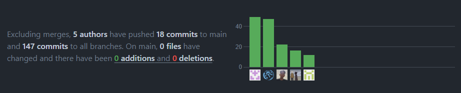

## Capítulo-II-Requirements-Elicitation-&-Analysis

### 2.1. Competidores

Algunos de los competidores a los que HormonalCare podría enfrentarse son:

- MyTherapy: Esta aplicación permite a los usuarios realizar un seguimiento de su medicación y recordatorios de citas médicas. También ofrece funciones de seguimiento de síntomas y permite crear informes que pueden compartirse con los médicos.

- Cara Care: Es una aplicación diseñada para el seguimiento y tratamiento del acné hormonal. Utiliza inteligencia artificial para analizar fotografías de la piel y proporcionar recomendaciones personalizadas de tratamiento.

- iClinic: Una aplicación de gestión médica que permite a los pacientes llevar un registro de sus consultas médicas, medicamentos, resultados de laboratorio y síntomas. Puede ser útil para el seguimiento de enfermedades hormonales mediante el registro de síntomas y medicamentos recetados.

<<<<<<< HEAD
## TB1 REPORT
=======
#### 2.1.1. **Análisis competitivo**
>>>>>>> origin/Capítulo-II-Requirements-Elicitation-&-Analysis

<table><tr><th colspan="6" valign="top"><b>Competitive Analysis Landscape</b></th><th colspan="1"></th><th colspan="1"></th></tr>
<tr><td colspan="3" valign="top">¿Por qué llevar a cabo este análisis?  </td><td colspan="3" valign="top">Este análisis se lleva a cabo para poder investigar, analizar y comparar el comportamiento de los competidores directos o indirectos en el mercado.</td><td colspan="1"></td><td colspan="1"></td></tr>
<tr><td colspan="2" valign="top"><b>Nombre</b></td><td colspan="1" valign="top"><b>HormonalCare</b></td><td colspan="1" valign="top"><b>MyTherapy</b></td><td colspan="1" valign="top"><b>Cara Care</b></td><td colspan="1" valign="top"><b>iClinic</b></td><td colspan="1"></td><td colspan="1"></td></tr>

<tr><td colspan="1" rowspan="4" valign="top"><b>Perfil</b></td><td colspan="1" rowspan="2" valign="top"><b>Overview</b></td><td colspan="1" rowspan="2" valign="top">Plataforma tecnológica sólida y centrada en el paciente para el seguimiento médico de enfermedades hormonales en el Perú. Con funciones que van desde el acceso a especialistas hasta el seguimiento continuo, la educación y la comunicación mejorada.</td><td colspan="1" rowspan="2" valign="top">Aplicación integral diseñada para ayudar a las personas a gestionar su salud y bienestar de manera efectiva, facilitando el seguimiento de la medicación, el registro de síntomas y estados de ánimo, y la comunicación con los profesionales médicos.</td><td colspan="1" rowspan="2" valign="top">Aplicación integral diseñada para ayudar a las personas a gestionar y mejorar las condiciones de la piel, ofreciendo seguimiento de síntomas, asesoramiento personalizado, educación sobre la piel y comunicación con profesionales de la salud para un cuidado óptimo de la piel.</td><td colspan="1" rowspan="2" valign="top">Aplicación integral diseñada para mejorar la eficiencia y la calidad de la atención médica al ofrecer funciones de gestión de pacientes, programación de citas, historiales clínicos electrónicos, facturación y comunicación segura entre profesionales de la salud y pacientes.</td><td colspan="1"></td><td colspan="1"></td></tr>
<tr><td colspan="1"></td><td colspan="1"></td></tr>
<tr><td colspan="1" rowspan="2" valign="top"><b>Ventaja competitiva ¿Qué valor ofrece a los clientes?</b></td><td colspan="1" rowspan="2" valign="top">
Acceso conveniente a especialistas, seguimiento personalizado, educación, comunicación efectiva y mejora de la calidad de vida para los pacientes con enfermedades hormonales.

</td><td colspan="1" rowspan="2" valign="top">Un conjunto integral de herramientas que pueden mejorar la calidad de vida de los usuarios al facilitar la gestión de su salud y el seguimiento de su tratamiento médico.</td><td colspan="1" rowspan="2" valign="top">Enfoque personalizado, seguimiento integral, educación y recursos, comunicación con profesionales de la salud y enfoque en el bienestar integral.</td><td colspan="1" rowspan="2" valign="top">Gestión de consultorios médicos, que mejora la eficiencia operativa, la experiencia del paciente, el acceso a la información, la seguridad de datos y la adaptabilidad a las necesidades del cliente.</td><td colspan="1"></td><td colspan="1"></td></tr>
<tr><td colspan="1"></td><td colspan="1"></td></tr>
<tr><td colspan="1" rowspan="2" valign="top"><b>Perfil de Marketing</b></td><td colspan="1" valign="top"><b>Mercado objetivo</b></td><td colspan="1" valign="top">Pacientes con enfermedades hormonales que buscan una mejor gestión de su salud y profesionales de la salud especializados en endocrinología que desean mejorar la atención que brindan a sus pacientes.</td><td colspan="1" valign="top">Personas que enfrentan desafíos específicos en la gestión de su salud y medicación, así como en los profesionales de la salud que buscan mejorar la adherencia del paciente y la eficacia del tratamiento.</td><td colspan="1" valign="top">Desde aquellos que ya experimentan afecciones dermatológicas hasta aquellos interesados en el cuidado preventivo y el bienestar integral de la piel.</td><td colspan="1" valign="top">abarca tanto el sector público como el privado de la atención médica, y está dirigido a profesionales y establecimientos que deseen mejorar la gestión de sus consultorios médicos, la calidad de la atención al paciente y la eficiencia operativa.</td><td colspan="1"></td><td colspan="1"></td></tr>
<tr><td colspan="1" valign="top"><b>Estrategias de Marketing</b></td><td colspan="1" valign="top">Crear contenido educativo, utilizar redes sociales para promocionar la aplicación, colaborar con influencers en el campo de la salud y asistir a eventos médicos, conferencias y ferias comerciales relacionadas con la endocrinología.</td><td colspan="1" valign="top">Utilización de plataformas de publicidad en línea como Google Ads, Facebook Ads, etc. Colaboración con influencers y profesionales de la salud en redes sociales y colaboración con organizaciones de salud.</td><td colspan="1" valign="top">Utilizar plataformas como Facebook e instagram para promocionar la aplicación, trabajar con influencers y expertos en cuidado de la piel para aumentar la visibilidad de la aplicación y utilizar anuncios pagados en redes sociales y sitios web relacionados con la salud y el bienestar.</td><td colspan="1" valign="top">Utilización de plataformas de publicidad en línea como Google Ads, Facebook Ads, etc. Colaboración con influencers y profesionales de la salud en redes sociales y colaboración con organizaciones de salud.</td><td colspan="1"></td><td colspan="1"></td></tr>
<tr><td colspan="1" rowspan="3" valign="top"><b>Perfil de producto</b></td><td colspan="1" valign="top"><b>Productos y Servicios</b></td><td colspan="1" valign="top">Ofrece una aplicación diseñada para mejorar la gestión de enfermedades hormonales, facilitando el acceso a especialistas, ofreciendo seguimiento personalizado de la salud, proporcionando educación y recursos, gestionando citas médicas y facilitando la comunicación segura entre pacientes y profesionales de la salud.</td><td colspan="1" valign="top">Ofrece una suscripción premium que desbloquea características adicionales, como la capacidad de agregar recordatorios ilimitados, personalizar recordatorios con mensajes de voz y acceder a análisis avanzados de datos de salud.</td><td colspan="1" valign="top">Ofrece una combinación de tecnología móvil, seguimiento de síntomas y tratamiento, asesoramiento personalizado, comunicación con profesionales de la salud y educación sobre la piel para ayudar a las personas a gestionar y mejorar las condiciones de la piel de manera efectiva.</td><td colspan="1" valign="top">Ofrece una gama de productos y servicios diseñados para ayudar a los profesionales de la salud a gestionar de manera eficiente sus consultorios médicos, mejorar la atención al paciente y cumplir con las regulaciones de privacidad y seguridad de datos en el sector de la atención médica.</td><td colspan="1"></td><td colspan="1"></td></tr>
<tr><td colspan="1" valign="top"><b>Precios y Costos</b></td><td colspan="1" valign="top">Ofrece una suscripción mensual que brinda a los usuarios acceso a contenido exclusivo, funciones avanzadas y una experiencia sin publicidad a $8.95 USD al mes.</td><td colspan="1" valign="top">Ofrece una suscripción premium a $10 USD al mes, con posibles descuentos si se opta por planes trimestrales o anuales.</td><td colspan="1" valign="top">Ofrece una suscripción premium a $10 USD al mes, con posibles descuentos si se opta por planes trimestrales o anuales.</td><td colspan="1" valign="top">Los precios de suscripción mensual suelen oscilar entre $50 y $300 por usuario, dependiendo de las funcionalidades incluidas y el nivel de soporte ofrecido. Algunos proveedores también ofrecen descuentos por volumen para consultorios médicos con múltiples usuarios.</td><td colspan="1"></td><td colspan="1"></td></tr>
<tr><td colspan="1" valign="top"><b>Canales de distribución</b></td><td colspan="1" valign="top">
- Página web

- Aplicaciones móviles en dispositivos iOS y Android.
</td><td colspan="1" valign="top">
- Página web

- Aplicaciones móviles en dispositivos iOS y Android.
</td><td colspan="1" valign="top">
- Página web

- Aplicaciones móviles en dispositivos iOS y Android.
</td><td colspan="1" valign="top">
- Página web

- Aplicaciones móviles en dispositivos iOS y Android.
</td><td colspan="1"></td><td colspan="1"></td></tr>
<tr><td colspan="1" rowspan="4" valign="top"><b>Análisis FODA</b></td><td colspan="1" valign="top"><b>Fortalezas</b></td><td colspan="1" valign="top">
- Acceso rápido a médicos a través de video consultas.

- Plataforma tecnológica segura y eficiente

- Seguimiento continuo de los niveles hormonales y síntomas de los pacientes.
</td><td colspan="1" valign="top">
- Interfaz intuitiva y fácil de usar 

- Funcionalidades avanzadas como recordatorios personalizables.

- Disponibilidad en múltiples plataformas móviles

- Integración con dispositivos y aplicaciones de salud.
</td><td colspan="1" valign="top">
- La capacidad de proporcionar recomendaciones y consejos personalizados basados en la información del usuario 

- Comunicación con profesionales de la salud

- Enfoque en el bienestar integral

- Educación y recursos
</td><td colspan="1" valign="top">
- Ofrece un conjunto completo de herramientas para la gestión de consultorios médicos, que incluye programación de citas, gestión de pacientes, historiales clínicos electrónicos y facturación Interfaz intuitiva

- Seguridad y cumplimiento normativo

- Soporte técnico y formación:
</td><td colspan="1"></td><td colspan="1"></td></tr>
<tr><td colspan="1" valign="top"><b>Debilidades</b></td><td colspan="1" valign="top">
- Dependencia de la conectividad a internet

- Posible resistencia por parte de algunos pacientes a adoptar tecnologías de salud digital.

- Limitaciones en la disponibilidad de especialistas para consultas presenciales.
</td><td colspan="1" valign="top">
- Dependencia de la tecnología móvil

- Algunas características avanzadas pueden requerir una suscripción premium

- La competencia en el mercado de aplicaciones de salud y bienestar. 
</td><td colspan="1" valign="top">
- La aplicación móvil depende en gran medida de la tecnología

- Competencia en el mercado.

- Requerimiento de datos personales

- Necesidad de actualizaciones constantes
</td><td colspan="1" valign="top">
- Competencia en el mercado

- Dependiendo de las características y el alcance del plan de suscripción, los costos pueden ser prohibitivos para algunos consultorios médicos

- Adaptabilidad a mercados específicos
</td><td colspan="1"></td><td colspan="1"></td></tr>
<tr><td colspan="1" valign="top"><b>Oportunidades</b></td><td colspan="1" valign="top">
 

Potencial para expandir la aplicación a otras regiones o países.

Colaboraciones con organizaciones de salud pública para llegar a más pacientes.
</td><td colspan="1" valign="top">
- El crecimiento continuo del mercado de salud digital 

- La posibilidad de colaboraciones estratégicas con proveedores de atención médica

- El desarrollo de nuevas características y servicios innovadores.
</td><td colspan="1" valign="top">
- Expansión a nuevos mercados

- Colaboraciones estratégicas.

- La integración con tecnologías emergentes, como inteligencia artificial o realidad aumentada.

- Investigación y desarrollo continuos
</td><td colspan="1" valign="top">
- Crecimiento del mercado de salud digital

- Innovación tecnológica

- Expansión geográfica
</td><td colspan="1"></td><td colspan="1"></td></tr>
<tr><td colspan="1" valign="top"><b>Amenazas</b></td><td colspan="1" valign="top">
- Competencia de otras aplicaciones de salud digital que ofrecen servicios similares.

- Posible falta de confianza por parte de algunos pacientes en la seguridad y privacidad de los datos médicos en línea.
</td><td colspan="1" valign="top">
- La preocupación por la privacidad de los datos de salud y la seguridad de la información puede afectar la confianza de los usuarios en la aplicación.

- La competencia de otras aplicaciones de salud y bienestar
</td><td colspan="1" valign="top">
- Competencia de otras plataformas de suscripción

- Problemas legales de derechos de autor

- Limitaciones de catálogo

- Cambios en las preferencias de los usuarios
</td><td colspan="1" valign="top">
- Cambios en las regulaciones y políticas gubernamentales en el sector de la salud 

- Las amenazas de seguridad cibernética

- Competidores emergentes
</td><td colspan="1"></td><td colspan="1"></td></tr>
</table>

<<<<<<< HEAD
**Producto**: HormonalCare
=======
>>>>>>> origin/Capítulo-II-Requirements-Elicitation-&-Analysis

#### 2.1.2.   **Estrategias y tácticas frente a competidores.**

A continuación, vamos a incluir las estrategias y tácticas preliminares que nuestro startup implementará para afrontar a nuestros competidores, de modo que aplicaremos lo siguiente:

- Diseñar una interfaz de usuario intuitiva y amigable, superando la competencia en términos de facilidad de uso y experiencia del usuario.
- Implementar un sistema de seguimiento y análisis de datos avanzado, permitiendo una optimización proactiva de los tratamientos y diferenciándonos por nuestro enfoque basado en la evidencia.
- Brindar un servicio al cliente excepcional, ofreciendo soporte técnico y asesoramiento médico personalizado, destacándonos como una solución integral y confiable.
- Establecer políticas de precios flexibles y competitivas, garantizando una mayor accesibilidad a nuestra solución y capturando diferentes segmentos de mercado.
- Ofrecer un acceso fácil y rápido a la información médica personal, permitiendo a los pacientes monitorear y comprender mejor su condición de salud a través de nuestra aplicación.
- Proporcionar herramientas interactivas para el autocuidado y la gestión de la salud, como recordatorios de medicación, seguimiento de síntomas y consejos de estilo de vida saludable
- Incorporar funciones de telemedicina y consulta en línea, permitiendo a los pacientes acceder a atención médica inmediata y sin barreras geográficas desde la comodidad de sus hogares.
- Garantizar la privacidad y seguridad de los datos del paciente, estableciendo altos estándares de protección de la información personal y médica dentro de la aplicación.

### 2.2. Entrevistas.
#### 2.2.1.   Diseño de entrevistas.

**Para los médicos especialistas:**
1.	¿Cuál es su especialidad médica y cuántos años lleva ejerciéndola?
2.	¿Ejerce su práctica médica en el sector privado o público?
3.	¿Cómo calificaría la satisfacción de los pacientes en los centros de salud tradicionales estatales y cómo cree que una aplicación podría mejorar esta experiencia?
4.	¿Cuáles considera que son las enfermedades más frecuentes en su área de especialización?
5.	¿Cuáles son las mayores dificultades que enfrenta al hacer seguimiento a sus pacientes con enfermedades hormonales?
6.	¿Qué porcentaje de sus pacientes cumple con el tratamiento prescrito y alcanza los objetivos planteados en la evaluación médica?
7.	¿Con qué frecuencia realiza el seguimiento de sus pacientes y si considera que es indispensable realizarlo de manera presencial o puede ser a distancia a través de tecnologías de comunicación?
8.	¿Cuán frecuente es para usted modificar el tratamiento de sus pacientes en función de los resultados de seguimiento, como análisis de laboratorio, peso y síntomas variados?
9.	¿Consideraría que es importante una aplicación para el seguimiento y tratamiento de enfermedades hormonales?
10.	¿Qué ventajas cree que podría ofrecerle a usted y a sus pacientes la utilización de una aplicación para el seguimiento y tratamiento de enfermedades hormonales?
11.	¿Cuáles son las condiciones básicas que deberían cumplirse para que pueda darse una atención efectiva a través de una aplicación?
12.	¿Qué funcionalidades le gustaría que tuviera la aplicación por enfermedad a tratar?, ¿cuáles crees que deberían ser las principales?
13.	¿Cree que la implementación de esta aplicación podría aumentar su cartera de pacientes y la demanda de sus servicios?

Preguntas complementarias:
*	¿Cuál es su nombre?
*	¿Cuántos años tiene?
*	¿En qué localidad labora? 
*	¿Cuál es su estado civil?
*	¿Cuál es su rango salarial aproximado?
*	¿Cuál sería la frase con la que te sientes más identificado?
*	En una escala del 1 al 10, ¿hasta qué punto te sientes motivado por recompensas, reconocimientos o beneficios materiales en tu vida personal o profesional?
*	En una escala del 1 al 10, ¿hasta qué punto sientes que el miedo o la preocupación por ciertas consecuencias te impulsan a tomar decisiones o actuar de cierta manera?
*	En una escala del 1 al 10, ¿hasta qué punto te sientes motivado por alcanzar metas, superar desafíos o destacar en tus actividades?
*	En una escala del 1 al 10, ¿hasta qué punto te sientes motivado por aprender, desarrollarte personal o profesionalmente, y buscar nuevas experiencias?
*	En una escala del 1 al 10, ¿hasta qué punto te sientes motivado por demostrar fortaleza física, mental o emocional, y superar obstáculos?
*	En una escala del 1 al 10, ¿hasta qué punto te sientes motivado por interactuar con otras personas, establecer conexiones sociales y formar parte de grupos o comunidades?
*	¿Qué dispositivos tecnológicos usa más en su cargo como médico?
*	¿Qué sistema operativo usa más en su cargo como médico?
*	¿Cuál es su navegador web favorito?
*	¿Cuáles son las marcas de los dispositivos, artículos o softwares que te ayudan en tu labor en tu día a día?

**Para los pacientes:**
1. ¿Qué enfermedad hormonal padeces y cuánto tiempo llevas siendo diagnosticado/a con ella?
2. ¿Cuáles son las principales dificultades que enfrentas en el seguimiento y tratamiento de tu enfermedad hormonal?
3. ¿Con qué frecuencia visitas a tu médico endocrinólogo para seguimiento y ajuste de tratamiento?
4. ¿Te resulta complicado cumplir con el tratamiento médico prescrito? ¿Qué factores influyen en tu adherencia al tratamiento?
5. ¿Qué aspectos de tu tratamiento o seguimiento médico te gustaría que fueran más fáciles o convenientes?
6. ¿Has tenido alguna experiencia negativa o frustrante en la atención médica relacionada con tu enfermedad hormonal? ¿Qué mejorarías de esa experiencia?
7. ¿Utilizarías una aplicación móvil para llevar un registro de tu historial médico, resultados de análisis hormonales y comunicarte con tu médico?
8. ¿Qué características consideras más importantes en una aplicación diseñada para el seguimiento y tratamiento de enfermedades hormonales?
9. ¿Cómo preferirías recibir recordatorios o alertas sobre tu medicación y citas médicas?
10. ¿Qué información te gustaría poder compartir con tu médico a través de una aplicación para facilitar tu seguimiento y tratamiento?
11. ¿Te sentirías más seguro/a con la posibilidad de comunicarte con tu médico de forma remota a través de una aplicación?
12. ¿Consideras que una aplicación podría mejorar tu calidad de vida y control sobre tu enfermedad hormonal?

Preguntas complementarias:
*	¿Cuál es su nombre?
*	¿Cuántos años tiene?
*	¿En qué localidad vive? 
*	¿Cuál es su estado civil?
*	¿Cuál es su rango salarial aproximado?
*	¿Cuál sería la frase con la que te sientes más identificado?
*	En una escala del 1 al 10, ¿hasta qué punto te sientes motivado por recompensas, reconocimientos o beneficios materiales en tu vida personal o profesional?
*	En una escala del 1 al 10, ¿hasta qué punto sientes que el miedo o la preocupación por ciertas consecuencias te impulsan a tomar decisiones o actuar de cierta manera?
*	En una escala del 1 al 10, ¿hasta qué punto te sientes motivado por alcanzar metas, superar desafíos o destacar en tus actividades?
*	En una escala del 1 al 10, ¿hasta qué punto te sientes motivado por aprender, desarrollarte personal o profesionalmente, y buscar nuevas experiencias?
*	En una escala del 1 al 10, ¿hasta qué punto te sientes motivado por demostrar fortaleza física, mental o emocional, y superar obstáculos?
*	En una escala del 1 al 10, ¿hasta qué punto te sientes motivado por interactuar con otras personas, establecer conexiones sociales y formar parte de grupos o comunidades?
*	¿Qué dispositivos tecnológicos usa más?
*	¿Qué sistema operativo usa más?
*	¿Cuál es su navegador web favorito?
*	¿Cuáles son las marcas de los dispositivos, artículos o softwares que te ayudan en tu labor en tu día a día?

#### 2.2.2.   Registro de entrevistas.
##### >Segmento de usuario – Médicos endocrinólogos.

***Médico 1:***
| Datos del médico: | Entrevista |
|---|---|
|  
Nombres:  Luis Hernán
 
Apellidos: Chinchihualpa Montes
 
 Edad: 53 años
 
 Localidad: Lima
| [Enlace Entrevista](https://upcedupe-my.sharepoint.com/personal/u202212112_upc_edu_pe/_layouts/15/stream.aspx?id=%2Fpersonal%2Fu202212112%5Fupc%5Fedu%5Fpe%2FDocuments%2FShared%2FEntrevista%20endocrin%C3%B3logo%201%2Emp4&ga=1") |
| Resumen:
Luis Chinchihualpa opina que la atención endocrinológica actual presenta dificultades como largos tiempos de espera, escasez de médicos y dificultades en el seguimiento. La telemedicina surge como una alternativa para mejorar la accesibilidad y eficiencia de la atención. Una aplicación de telemedicina ideal debería ser fácil de usar, ofrecer información clara sobre la patología y el tratamiento, permitir el registro de datos del paciente, facilitar el seguimiento del progreso y ser personalizable. La telemedicina tiene el potencial de mejorar la calidad de vida de los pacientes con enfermedades endocrinas.Se concluye que la telemedicina es una herramienta valiosa que puede mejorar significativamente la atención endocrinológica.
 | 

| **Fila 2** |
***Médico 2:***
| Datos del médico: | Entrevista |
|---|---|
|  
Nombres:  Ricardo 
 
Apellidos: Durand
 
 Edad: 48 años
 
 Localidad: Surco
| [Enlace Entrevista](https://upcedupe-my.sharepoint.com/personal/u202215099_upc_edu_pe/_layouts/15/stream.aspx?id=%2Fpersonal%2Fu202215099%5Fupc%5Fedu%5Fpe%2FDocuments%2FEntrevista%20endocrin%C3%B3logo%202%2Emp4&nav=eyJyZWZlcnJhbEluZm8iOnsicmVmZXJyYWxBcHAiOiJTdHJlYW1XZWJBcHAiLCJyZWZlcnJhbFZpZXciOiJTaGFyZURpYWxvZy1MaW5rIiwicmVmZXJyYWxBcHBQbGF0Zm9ybSI6IldlYiIsInJlZmVycmFsTW9kZSI6InZpZXcifX0%3D&nav=eyJyZWZlcnJhbEluZm8iOnsicmVmZXJyYWxBcHAiOiJTdHJlYW1XZWJBcHAiLCJyZWZlcnJhbFZpZXciOiJTaGFyZURpYWxvZy1MaW5rIiwicmVmZXJyYWxBcHBQbGF0Zm9ybSI6IldlYiIsInJlZmVycmFsTW9kZSI6InZpZXcifX0=&ga=1) |
| Resumen:
Ricardo Durand, endocrinólogo con 3 años de experiencia en el sector privado, destaca la alta satisfacción de los pacientes debido a la rapidez de atención en comparación con el sector público. Sugiere el desarrollo de una aplicación para facilitar el control y la comunicación con el médico, especialmente en el manejo de la diabetes, que constituye el 95% de sus consultas y enfrenta dificultades en el control glucémico. 
Propone un seguimiento remoto para reducir la necesidad de citas presenciales, especialmente efectivo para pacientes estables, mientras que los recién diagnosticados podrían requerir visitas mensuales. Recomienda que la aplicación sea fácil de usar para una experiencia eficaz tanto para pacientes como para médicos.

 | 

| Resumen |
***Médico 3:***
| Datos del médico: | Entrevista |
|---|---|
|  
Nombres:  Roxana 
 
Apellidos: Podésta
 
 Edad: 38 años
 
 Localidad: Centro de lima
| [Enlace Entrevista](https://upcedupe-my.sharepoint.com/personal/u202212112_upc_edu_pe/_layouts/15/stream.aspx?id=%2Fpersonal%2Fu202212112%5Fupc%5Fedu%5Fpe%2FDocuments%2FShared%2FEntrevista%20endocrino%CC%81logo%203%2Emp4&nav=eyJyZWZlcnJhbEluZm8iOnsicmVmZXJyYWxBcHAiOiJTdHJlYW1XZWJBcHAiLCJyZWZlcnJhbFZpZXciOiJTaGFyZURpYWxvZy1MaW5rIiwicmVmZXJyYWxBcHBQbGF0Zm9ybSI6IldlYiIsInJlZmVycmFsTW9kZSI6InZpZXcifX0&ga=1&referrer=StreamWebApp%2EWeb&referrerScenario=AddressBarCopied%2Eview) |
| Resumen:
Roxana Podesta, endocrinóloga con 5 años de experiencia, describe las dificultades en la atención actual: largos tiempos de espera (4-5 meses) y baja adherencia al tratamiento. La telemedicina, mediante una aplicación, podría mejorar la accesibilidad, el seguimiento y la satisfacción del paciente. Las enfermedades más comunes son diabetes, resistencia a la insulina, obesidad, problemas de tiroides y dislipidemias. La falta de seguimiento adecuado y los largos tiempos de espera impactan negativamente en la salud del paciente. Se propone una aplicación que facilite la comunicación, el registro de datos, el seguimiento y la organización de citas. Esta herramienta optimizaría el tiempo del médico y la atención al paciente, especialmente para aquellos que requieren un seguimiento más estrecho.

 | 

##### >Segmento de usuario – Pacientes con enfermedades hormonales.

***Paciente 1:***
| Datos del paciente: | Entrevista |
|---|---|
|  
Nombres:  Joaquin 
 
Apellidos: Benavides
 
 Edad: 20 años
 
 Localidad: San Miguel, Lima
| [Enlace Entrevista](https://upcedupe-my.sharepoint.com/personal/u202211742_upc_edu_pe/_layouts/15/stream.aspx?id=%2Fpersonal%2Fu202211742%5Fupc%5Fedu%5Fpe%2FDocuments%2FEntrevista%5FJoaquin%2Emp4&ga=1) |
| Resumen:
Joaquín Benavides ha enfrentado desafíos en el seguimiento de su tratamiento para el hipotiroidismo debido a la burocracia en los servicios de salud y las largas esperas para consultas médicas. A pesar de visitar a su endocrinólogo cada tres meses, ha tenido dificultades al explicar sus síntomas a médicos poco familiarizados con su condición, lo que ha retrasado el tratamiento adecuado y afectado su adherencia al mismo. Para mejorar su experiencia, Joaquín estaría interesado en una aplicación móvil que le ayude a recordar tomar su medicación diaria, proporcione información sobre el hipotiroidismo y facilite la comunicación directa con su médico para consultas o ajustes en el tratamiento. Considera esencial que esta aplicación ofrezca características como recordatorios de medicación personalizables, acceso fácil a información relevante y una vía segura de comunicación con su médico.

 | 

***Paciente 2:***
| Datos del paciente: | Entrevista |
|---|---|
|  
Nombres:  Arnhol Alfredo 
 
Apellidos: Castrejón Calderon
 
 Edad: 19 años.
 
 Localidad: La Victoria, Lima.
| [Enlace Entrevista](https://upcedupe-my.sharepoint.com/personal/u202218451_upc_edu_pe/_layouts/15/stream.aspx?id=%2Fpersonal%2Fu202218451%5Fupc%5Fedu%5Fpe%2FDocuments%2FEntrevista%5FPaciente%5F2%2Emp4&nav=eyJyZWZlcnJhbEluZm8iOnsicmVmZXJyYWxBcHAiOiJTdHJlYW1XZWJBcHAiLCJyZWZlcnJhbFZpZXciOiJTaGFyZURpYWxvZy1MaW5rIiwicmVmZXJyYWxBcHBQbGF0Zm9ybSI6IldlYiIsInJlZmVycmFsTW9kZSI6InZpZXcifX0%3D&nav=eyJyZWZlcnJhbEluZm8iOnsicmVmZXJyYWxBcHAiOiJTdHJlYW1XZWJBcHAiLCJyZWZlcnJhbFZpZXciOiJTaGFyZURpYWxvZy1MaW5rIiwicmVmZXJyYWxBcHBQbGF0Zm9ybSI6IldlYiIsInJlZmVycmFsTW9kZSI6InZpZXcifX0=&ga=1) |
| Resumen:
El paciente Anrhol que presenta hipotiroidismo, indica que una de las principales desventajas que enfrenta en su tratamiento hormonal sería el seguimiento de sus controles, las fechas en las que tiene citas médicas y el horario para consumir su medicación. Además, expresa que va cada tres meses a una cita médica, donde se revisa los síntomas y el estado del tratamiento. 

Por otro lado, comenta que le gustaría tener acceso a una comunicación directa con el médico para consultarle algunos problemas que puedan surgir, ya que una experiencia frustrante en el proceso de su tratamiento fue la larga espera para lograr atenderse. Entonces, nuestro entrevistado comenta que utilizaría una aplicación sencilla y muy segura donde pueda comunicarse directamente con el médico de forma remota para comentarle sus necesidades, ver sus análisis, agendar las fechas para citas médicas y establecer un horario para consumir las medicinas con recordatorios a través de notificaciones directas desde la aplicación o como mensaje de texto por algún medio de preferencia. 

 Asimismo, el paciente nos comparte por medio de la encuesta que utiliza más Tablet, sistema operativo Android, software como spacedesk y otras aplicaciones para tomar notas. También, que utiliza Samsung y el navegador de Chrome. Luego, escribe que esta más motivado por desarrollarse y cumplir sus metas que el tener miedo de tomar decisiones.

 | 

***Paciente 3:***
| Datos del paciente: | Entrevista |
|---|---|
|  
Nombres:  Alicia Alison 
 
Apellidos: Garrido Lujan
 
 Edad: : 20 años
 
 Localidad: Surco
| [Enlace Entrevista](https://upcedupe-my.sharepoint.com/:v:/g/personal/u202215312_upc_edu_pe/Ea60WGZjSFFHj9kt3SmwzvABQ7xKJQlJuQYqo-SWBmZnQA?e=2S1EKe&nav=eyJyZWZlcnJhbEluZm8iOnsicmVmZXJyYWxBcHAiOiJTdHJlYW1XZWJBcHAiLCJyZWZlcnJhbFZpZXciOiJTaGFyZURpYWxvZy1MaW5rIiwicmVmZXJyYWxBcHBQbGF0Zm9ybSI6IldlYiIsInJlZmVycmFsTW9kZSI6InZpZXcifX0%3D) |
| Resumen:
El entrevistado es una mujer con hipertiroidismo diagnosticada hace aproximadamente 2 años. Enfrenta desafíos con los cambios constantes en sus niveles hormonales, que afectan su estado de ánimo y energía, y la dificultad de ajustar la medicación para controlar síntomas como ansiedad y fatiga. Visita a su endocrinólogo cada 3 meses. A veces le resulta complicado cumplir con el tratamiento debido a efectos secundarios y la interferencia de la rutina diaria. Le gustaría un sistema de recordatorios más efectivo y acceso a recursos educativos sobre su enfermedad. Ha tenido experiencias frustrantes con largos tiempos de espera y comunicación limitada con su médico. Utilizaría una aplicación móvil para llevar un registro médico y comunicarse con su médico, destacando la importancia de una interfaz fácil de usar, recordatorios personalizables y comunicación segura. Prefiere recibir notificaciones en su teléfono móvil y compartir información relevante con su médico a través de la aplicación. Se sentiría más segura con la posibilidad de comunicarse remotamente con su médico y cree que una aplicación mejoraría significativamente su calidad de vida y control sobre su enfermedad hormonal.

 | 

#### 2.2.3.  Análisis de entrevistas.
##### >Segmento de usuario – Pacientes con enfermedades hormonales.
1)	De la pregunta, "¿Qué enfermedad hormonal padeces y cuánto tiempo llevas siendo diagnosticado/a con ella?" se puede concluir que:

El 100% de los pacientes entrevistados padecen una enfermedad hormonal, con un 66.7% diagnosticado con hipotiroidismo y el restante 33.3% con hipertiroidismo. En cuanto al tiempo desde el diagnóstico, dos pacientes (66.7%) han sido diagnosticados hace aproximadamente 5 años, mientras que el tercero (33.3%) fue diagnosticado hace aproximadamente 2 años. Esto sugiere una prevalencia significativa de hipotiroidismo en la muestra, con una duración promedio del diagnóstico en torno a los 5 años.

2)	De la pregunta, "¿Cuáles son las principales dificultades que enfrentas en el seguimiento y tratamiento de tu enfermedad hormonal?" se puede concluir que:

El 100% de los pacientes reportan dificultades en el seguimiento y tratamiento de su enfermedad hormonal. La mayoría de ellos (66.7%) mencionan la necesidad constante de ajustar la dosis de medicación para mantener los niveles hormonales estables, debido a la lentitud de los servicios de salud en la programación de citas. Además, un paciente (33.3%) destaca las dificultades para seguir los controles y recordar tomar la medicación, mientras que otro (33.3%) menciona los cambios constantes en los niveles hormonales, que afectan su estado de ánimo y energía, así como la dificultad para ajustar la medicación y controlar los síntomas como la ansiedad y la fatiga. 

3)	De la pregunta, "¿Con qué frecuencia visitas a tu médico endocrinólogo para seguimiento y ajuste de tratamiento?" se puede concluir que:

El 100% de los pacientes entrevistados visitan a su médico endocrinólogo con una frecuencia de cada 3 meses para seguimiento y ajuste de tratamiento. Esto indica una consistencia en la atención médica programada, lo que sugiere una práctica estándar en el manejo de la enfermedad hormonal en la muestra analizada.

4)	De la pregunta, "¿Te resulta complicado cumplir con el tratamiento médico prescrito? ¿Qué factores influyen en tu adherencia al tratamiento?" se puede concluir que:

El 66.7% de los pacientes mencionan dificultades para cumplir con el tratamiento médico prescrito. Uno de los factores principales es la disponibilidad y los altos costos de la medicación, así como la dificultad para obtenerla debido a la falta de facilitación por parte de los hospitales. Además, otro paciente (33.3%) señala los efectos secundarios de la medicación, como la pérdida de apetito o problemas para conciliar el sueño, así como la interferencia de la rutina diaria en los horarios de medicación. 

5)	De la pregunta, "¿Qué aspectos de tu tratamiento o seguimiento médico te gustaría que fueran más fáciles o convenientes?" se puede concluir que:

El 100% de los pacientes expresan deseos de que el seguimiento médico y el tratamiento sean más fáciles y convenientes. Un aspecto comúnmente mencionado es la necesidad de una aplicación que facilite la adherencia al tratamiento, proporcionando recordatorios sobre la medicación y ofreciendo información útil sobre la enfermedad. También destacan la importancia de facilitar el contacto con el médico y obtener resultados de manera más rápida y accesible. Además, expresan el deseo de acceder a recursos educativos sobre su enfermedad y opciones de tratamiento. Esto indica una demanda clara de soluciones tecnológicas que mejoren la experiencia del paciente y simplifiquen la gestión de la enfermedad hormonal.

6)	De la pregunta, "¿Has tenido alguna experiencia negativa o frustrante en la atención médica relacionada con tu enfermedad hormonal? ¿Qué mejorarías de esa experiencia?" se puede concluir que:

El 66.7% de los pacientes reportan haber experimentado frustraciones en la atención médica relacionada con su enfermedad hormonal, principalmente debido a los largos tiempos de espera para las citas médicas. Además, los pacientes mencionan la dificultad para comunicarse con su médico entre visitas como un aspecto negativo de su experiencia.

7)	De la pregunta, "¿Utilizarías una aplicación móvil para llevar un registro de tu historial médico, resultados de análisis hormonales y comunicarte con tu médico?" se puede concluir que:

El 100% de los pacientes están dispuestos a utilizar una aplicación móvil para llevar un registro de su historial médico, resultados de análisis hormonales y comunicarse con su médico. Esto sugiere un interés generalizado en herramientas tecnológicas que faciliten la gestión de su enfermedad hormonal y mejoren la comunicación con los profesionales de la salud. 

8)	De la pregunta, "¿Qué características consideras más importantes en una aplicación diseñada para el seguimiento y tratamiento de enfermedades hormonales?" se puede concluir que:

El 100% de los pacientes destacan la importancia de ciertas características clave en una aplicación diseñada para el seguimiento y tratamiento de enfermedades hormonales. Esto incluye la necesidad de recordatorios para la medicación, acceso fácil a información sobre la patología que afecta al paciente y la capacidad de comunicarse de manera segura con el médico. Además, mencionan la importancia de la facilidad de uso, la seguridad de los datos personales y la disponibilidad de recordatorios para tomar la medicación. 

9)	De la pregunta, "¿Cómo preferirías recibir recordatorios o alertas sobre tu medicación y citas médicas?" se puede concluir que:

El 100% de los pacientes expresan preferencia por recibir recordatorios o alertas sobre su medicación y citas médicas a través de notificaciones push en su teléfono móvil. Destacan la importancia de la personalización, mencionando la posibilidad de ajustar la frecuencia y el contenido de los recordatorios según sus necesidades individuales. Esto resalta la conveniencia que ofrecen las notificaciones para mejorar la adherencia al tratamiento y la puntualidad en las citas médicas.

10)	De la pregunta, "¿Qué información te gustaría poder compartir con tu médico a través de una aplicación para facilitar tu seguimiento y tratamiento?" se puede concluir que:

El 100% de los pacientes desean poder compartir información relevante con su médico a través de una aplicación para facilitar su seguimiento y tratamiento. Esto incluye síntomas, cambios en el peso, efectos secundarios de la medicación y cualquier otra información que pueda ayudar al médico a comprender mejor su situación. 

11)	De la pregunta, "¿Te sentirías más seguro/a con la posibilidad de comunicarte con tu médico de forma remota a través de una aplicación?" se puede concluir que:

El 100% de los pacientes expresan sentirse más seguros con la posibilidad de comunicarse con su médico de forma remota a través de una aplicación. Destacan la conveniencia y rapidez que esto proporcionaría para abordar preocupaciones, recibir asesoramiento rápido y hacer preguntas sobre su tratamiento.

12)	De la pregunta, "¿Consideras que una aplicación podría mejorar tu calidad de vida y control sobre tu enfermedad hormonal?" se puede concluir que:

El 100% de los pacientes consideran que una aplicación podría mejorar significativamente su calidad de vida y control sobre su enfermedad hormonal. Destacan que una aplicación bien diseñada podría ofrecer un mejor control sobre la enfermedad, una comunicación rápida con el equipo médico y herramientas para gestionar el tratamiento de manera más efectiva.

Finalmente, se realizó una encuesta de Formulario de Google para la obtención de datos extra sobre nuestro segmento pacientes:

[Resultados de las respuesta de los pacientes](https://docs.google.com/spreadsheets/d/18ymG7icz4uSKDMLTZHZjehKpsIX3hhprjjFXo9H5tQ8/edit?usp=sharing)

##### >Segmento de usuario – Médicos endocrinólogos.
Conclusión:
1)	De la pregunta "¿Cuál es su especialidad médica y cuántos años lleva ejerciéndola?" podemos concluir que: 

La especialidad médica más común entre las respuestas es Endocrinología, representando el 100% de las respuestas. Respecto a la experiencia laboral, se observa una variedad en los años de ejercicio, con un promedio de 5.3 años y una desviación estándar de aproximadamente 2.1 años. La respuesta más común es 8 años de experiencia, seguida por 5 años y luego 3 años.

2)	De la pregunta "¿Ejerce su práctica médica en el sector privado o público?" podemos concluir que:

Existe una diversidad en las modalidades de ejercicio médico entre los entrevistados. El 66.7% ejerce en ambos sectores (tanto público como privado), mientras que el 33.3% ejerce únicamente en el sector privado. Esto sugiere una preferencia hacia la diversificación de la práctica médica entre los sectores público y privado, posiblemente influenciada por consideraciones financieras y de accesibilidad para los pacientes.

3)	De la pregunta "¿Cómo calificaría la satisfacción de los pacientes en los centros de salud tradicionales estatales y cómo cree que una aplicación podría mejorar esta experiencia?" podemos concluir que:

Se puede observar que existe una percepción generalizada de insatisfacción entre los pacientes respecto a los servicios ofrecidos en el sector público. El 66.7% de los médicos entrevistados destacan problemas como largos tiempos de espera para citas, infraestructura limitada y disponibilidad reducida de medicamentos. Sin embargo, el 33.3% considera que la experiencia en el sector privado es más satisfactoria, atribuyéndolo a la rapidez de la consulta. Todos los médicos coinciden en que una aplicación podría mejorar la experiencia del paciente, con un enfoque en agilizar los tiempos de espera para citas y mejorar la comunicación entre médico y paciente, lo que podría potencialmente aumentar la adherencia al tratamiento y el seguimiento del mismo.

4)	De la pregunta "¿Cuáles considera que son las enfermedades más frecuentes en su área de especialización?" podemos concluir que:

De acuerdo con las respuestas de los médicos entrevistados, se puede observar que hay un consenso en cuanto a las enfermedades más frecuentes en el área de endocrinología. El 100% de los médicos mencionan la diabetes como una de las principales patologías, con porcentajes específicos del 95% y un énfasis generalizado en su importancia. Además, trastornos relacionados con el peso, como la obesidad y el sobrepeso, son destacados por todos los médicos, con el 66.7% mencionando específicamente la obesidad como un factor de riesgo para la diabetes. Otras enfermedades endocrinas comunes incluyen trastornos de la glándula tiroides, resistencia a la insulina, síndrome de ovario poliquístico, así como dislipidemias. La prevalencia de ciertas condiciones, como el síndrome de ovario poliquístico, parece variar entre el sector público y privado, siendo más frecuente en el último, según el 33.3% de los médicos entrevistados. 

5)	De la pregunta "¿Cuáles son las mayores dificultades que enfrenta al hacer seguimiento a sus pacientes con enfermedades hormonales?" podemos concluir que:

El 66.7% de los médicos identifican largos tiempos de espera para conseguir una cita con un endocrinólogo, que puede variar entre 1 y 4 meses, debido a la escasez de especialistas, especialmente en el sector privado. Esto resalta la importancia de abordar la accesibilidad a la atención médica especializada en endocrinología. Además, el 33.3% de los médicos menciona dificultades en el control continuo de la enfermedad, especialmente con respecto al ajuste de la dosificación de insulina, lo que destaca la necesidad de soluciones alternativas para garantizar un seguimiento efectivo de los pacientes.

6)	De la pregunta "¿Qué porcentaje de sus pacientes cumple con el tratamiento prescrito y alcanza los objetivos planteados en la evaluación médica?" podemos concluir que:

Existe una marcada diferencia en el cumplimiento del tratamiento entre el sector público y privado. En el sector público, solo el 10-15% de los pacientes cumplen con el tratamiento, lo que refleja una lucha diaria y se atribuye en parte a la limitada rapidez en el contacto médico-paciente. Por otro lado, en el sector privado, el 90% de los pacientes cumplen con el tratamiento, principalmente porque lo están pagando de su propio bolsillo. En cuanto a los objetivos relacionados con la diabetes, el 70% de los pacientes en el sector privado los alcanzan, mientras que en el sector público este porcentaje tiende a ser más bajo. Además, en general, entre el 60-70% de los pacientes cumplen con sus objetivos, lo que sugiere que el cumplimiento del tratamiento puede verse influenciado por diversos factores, incluyendo el acceso y la capacidad de pago.

7)	De la pregunta "¿Con qué frecuencia realiza el seguimiento de sus pacientes y si considera que es indispensable realizarlo de manera presencial o puede ser a distancia a través de tecnologías de comunicación?" podemos concluir que:

Según los médicos entrevistados, el 66.7% considera que la tecnología puede agilizar el seguimiento de pacientes con enfermedades hormonales, permitiendo una comunicación más rápida y eficiente. El 33.3% menciona la posibilidad de utilizar teleconsulta y exámenes de laboratorio facilitados por el paciente, especialmente para enfermedades estables como la diabetes. Además, sugieren variar la frecuencia de seguimiento según la condición del paciente, con intervalos más cortos para nuevos casos. Esto sugiere una adaptación hacia un enfoque más flexible y tecnológico en el seguimiento de pacientes hormonales.

8)	De la pregunta "¿Cuán frecuente es para usted modificar el tratamiento de sus pacientes en función de los resultados de seguimiento, como análisis de laboratorio, peso y síntomas variados?" podemos concluir que:

La frecuencia de modificación del tratamiento varía según el estado del paciente y la estabilidad de su condición médica. En casos de pacientes nuevos o recién diagnosticados, la frecuencia de ajustes en el tratamiento tiende a ser más alta, con modificaciones mensuales e incluso diarias en algunos casos. Por otro lado, para pacientes con condiciones estables y regímenes de tratamiento establecidos, la frecuencia de modificación es menor, con controles regulares que pueden espaciarse a intervalos de tres o cuatro meses. Esta variabilidad en la frecuencia de modificación del tratamiento refleja la necesidad de una atención médica personalizada y adaptable a las necesidades cambiantes de los pacientes en función de su estado de salud y respuesta al tratamiento.

9)	De la pregunta "¿Consideraría que es importante una aplicación para el seguimiento y tratamiento de enfermedades hormonales?" podemos concluir que:

Se destaca la importancia de una aplicación para el seguimiento y tratamiento de enfermedades hormonales, especialmente en el contexto actual de la telemedicina, que se ha vuelto más común debido a la pandemia de COVID-19. La implementación de una aplicación podría agilizar el contacto entre médicos y pacientes, permitiendo alcanzar los objetivos terapéuticos de manera más rápida y mejorando la salud en general. Además, se señala que una aplicación sería especialmente útil para pacientes que requieren un seguimiento más cercano, como aquellos que utilizan insulina, ya que el tratamiento con esta hormona es dinámico y requiere ajustes frecuentes. La disponibilidad de una base de datos de pacientes con sus respectivas patologías y seguimientos actualizaría sería fundamental para garantizar un control adecuado, especialmente en entornos de atención médica pública.

10)	De la pregunta "¿Qué ventajas cree que podría ofrecerle a usted y a sus pacientes la utilización de una aplicación para el seguimiento y tratamiento de enfermedades hormonales?" podemos concluir que:

La utilización de una aplicación para el seguimiento y tratamiento de enfermedades hormonales ofrecería ventajas significativas tanto para los pacientes como para los médicos. Para los pacientes, implicaría menos costos y tiempo de movilización, además de permitirles continuar con su rutina diaria sin interrupciones. Esto aumentaría la accesibilidad al tratamiento. Para los médicos, la aplicación proporcionaría la capacidad de atender a más pacientes de manera más eficiente, lo que tendría un impacto económico positivo. Además, permitiría una modificación más rápida del tratamiento y una mejor gestión de la atención. En resumen, la aplicación mejoraría la adherencia al tratamiento, la calidad de la atención y reduciría los tiempos de espera para los pacientes, mientras que para los médicos facilitaría la organización y gestión de la atención médica.

11)	De la pregunta "¿Cuáles son las condiciones básicas que deberían cumplirse para que pueda darse una atención efectiva a través de una aplicación?" podemos concluir que:

Se destacan varias condiciones básicas que deben cumplirse para que la atención a través de una aplicación sea efectiva. En primer lugar, la aplicación debe ser accesible, intuitiva y fácil de usar, especialmente para pacientes de edad avanzada. Esto incluye características como botones grandes y visibles, así como una interfaz clara y sencilla. Además, la aplicación debe ser rápida y compatible con diferentes sistemas operativos, asegurando una conectividad adecuada incluso en áreas con condiciones climáticas adversas. También es crucial que la aplicación proporcione información clara y concisa sobre la patología del paciente, sus objetivos de tratamiento y el plan terapéutico utilizado. Por último, la aplicación debe contar con características como notificaciones y alertas para facilitar la comunicación entre el médico y el paciente, garantizando así una atención efectiva y oportuna.

12)	De la pregunta "¿Qué funcionalidades le gustaría que tuviera la aplicación por enfermedad a tratar?, ¿cuáles crees que deberían ser las principales?" podemos concluir que:

Las funcionalidades deseadas para una aplicación de seguimiento y tratamiento de enfermedades hormonales varían entre los médicos, pero hay algunas características principales que destacan. En primer lugar, la capacidad de registrar y monitorear datos relevantes para cada condición, como niveles de glucosa, parámetros de laboratorio y síntomas, es fundamental. Esto incluye la generación de informes y gráficos para una mejor visualización del progreso del paciente. Además, la aplicación debe permitir establecer objetivos claros y enviar recordatorios de medicación para mejorar la adherencia al tratamiento. También es importante que la aplicación facilite la exportación de datos para compartir información con otros profesionales de la salud y garantizar una atención coordinada. Por último, características específicas para cada enfermedad, como la generación de tablas basadas en resultados de laboratorio para el hipertiroidismo o la capacidad de registrar diferentes parámetros para pacientes diabéticos, son deseables para una atención personalizada y efectiva.

13)	De la pregunta "¿Cree que la implementación de esta aplicación podría aumentar su cartera de pacientes y la demanda de sus servicios?" podemos concluir que:

La implementación de esta aplicación podría tener un impacto positivo tanto en la cartera de pacientes como en la demanda de servicios. En primer lugar, facilitaría una comunicación más eficiente y una mejor gestión de los pacientes, lo que podría resultar en una mayor satisfacción y fidelidad por parte de estos. Esto podría conducir indirectamente a un aumento en la cartera de pacientes, ya que fortalecería la relación médico-paciente y evitaría la pérdida de clientes. Además, al mejorar la eficiencia en el seguimiento y tratamiento de enfermedades crónicas, como la diabetes, la aplicación podría liberar tiempo para que los médicos atiendan a nuevos pacientes, aumentando así la demanda de servicios médicos. En el sector estatal, donde la demanda ya supera la oferta, la implementación de la aplicación podría mejorar el seguimiento de los pacientes crónicos y liberar citas para nuevos pacientes, lo que haría que los servicios fueran más accesibles y, en última instancia, aumentaría la demanda de atención médica.

Finalmente, se realizó una encuesta de Formulario de Google para la obtención de datos extra sobre nuestro segmento médico:

[Resultados de las respuestas de los médicos](https://docs.google.com/spreadsheets/d/1AG_PKOa8czbNz00sYfzPndJZ8FENAuJ3JxAp0Lld1-Y/edit?usp=sharing)

### 2.3.      Needfinding.
#### 2.3.1.      User Personas.
La creación de User Personas es una práctica fundamental para comprender las necesidades, motivaciones y comportamientos de los usuarios. Un User Persona es una representación ficticia de un usuario típico de un producto o servicio, basada en datos reales de investigación de usuarios. Para esta ocasión se tomo en cuenta las respuestas que se dieron en la encuesta de Google Formularios, las respuestas que se dieron de durante la entrevista, tanto reacciones y la forma de expresarse de cada entrevistado, y el análisis de entrevista de cada segmento.

**Segmento paciente:**

[Enlace User Persona Paciente](https://drive.google.com/file/d/1af4btl7i7yPwyeY1d4j_AxOK0WOzMXru/view?usp=sharing)

**Segmento médico:**

[Enlace User Persona Médico](https://drive.google.com/file/d/1Ko71r-6_EvUxjYx1oJl8ELZcGRoFXeo4/view?usp=sharing)

### 2.3.2.   **User Task Matrix.** 

|**Task Matrix**|**Dr. Luis Chinchihualpa  Frecuencia    Importancia**|**Dr. Ricardo Durand  Frecuencia    Importancia**|**Dra. Roxana  Frecuencia    Importancia**|
**Joaquin Benavides**

 **Frecuencia    Importancia**
|**Arnold Castrejón  Frecuencia    Importancia**|**Alicia Garrido  Frecuencia    Importancia**||
| :-: | :-: | :-: | :-: | :-: | :-: | :-: | :- |
|**Enfrentan problemas de logística.**|A veces Alta|A veces Alta|A veces Alta|A veces Alta|A veces Alta|A veces Alta||
|**Registrar información médica personal.**|Siempre Alta|Siempre Alta|Siempre Alta|Siempre Alta|Siempre Alta|Siempre Alta||
|**Reservar una cita médica.**|A veces Alta|A veces Alta|A veces Alta|A veces Media|A veces Media|A veces Media||
|**Anotar los horarios (citas y receta medica).**|Siempre Media|Siempre Media|Siempre Media|Siempre Media|Siempre Media|Siempre Media||
|**Realizar seguimiento de la enfermedad hormonal.**|Siempre Alta|Siempre Alta|Siempre Alta|Siempre Media|Siempre Alta|Siempre Alta||
|**Acceder a información médica personal.**|Siempre Alta|Siempre Alta|Siempre Alta|Siempre Alta|Siempre Alta|Siempre Alta||
|**Analizar resultados de seguimiento.**|A veces Alta|Siempre Alta|Siempre Alta|A veces Baja|Siempre Media|Siempre Media||
|**Presentar resultado de los exámenes.**|A veces Alta|A veces Alta|A veces Alta|A veces Media|A veces Alta|A veces Alta||
|**Seguir una receta medica**|Siempre Alta|Siempre Alta|Siempre Alta|Siempre Media|Siempre Alta|Siempre Alta||

#### 2.3.3.   User Journey Mapping.
**User persona: Paciente**
Este User Journey Map sigue el viaje de un paciente que busca mejorar la gestión de su tratamiento hormonal a través de una aplicación especializada. Desde el descubrimiento de la aplicación hasta el seguimiento remoto de su progreso, exploraremos las experiencias, expectativas y desafíos que enfrenta el paciente a lo largo de su viaje para una atención médica más efectiva y personalizada.

[Enlace Customer journey map paciente](https://upcedupe-my.sharepoint.com/:i:/g/personal/u202218451_upc_edu_pe/EUt6YmBmmqBJhEAYMyU2sPoBD9v3z6-n6IC-Brbiz4juBA?e=3t796F)

**User persona: Médico**
Este User Journey Map sigue el viaje de un médico endocrinólogo que integra una aplicación de gestión de tratamientos hormonales en su práctica clínica. Desde la evaluación y la integración de la aplicación hasta el seguimiento remoto del progreso del paciente, exploraremos cómo esta herramienta mejora la coordinación, la eficiencia y la calidad de la atención médica para pacientes con enfermedades hormonales.

[Enlace Customer journey map medico](https://upcedupe-my.sharepoint.com/:i:/g/personal/u202218451_upc_edu_pe/ETzIplWry45GpxiDIa5cCrkB4mnJmWMK7207a6WB_jAnnA?e=0eRKCh)

#### 2.3.4.   Empathy Mapping.

**Paciente:**

**Médico:**

#### 2.3.5.   As-is Scenario Mapping.
El proceso de elaboración del As Is scenario mapping para nuestros dos segmentos objetivos implicó una detallada preparación, incluyendo la definición de objetivos, la identificación de stakeholders y la recopilación de datos relevantes sobre el proceso actual de atención médica. Luego, mediante una lluvia de ideas individual, cada miembro del equipo identificó aspectos positivos, negativos y áreas de mejora en el proceso. Estos hallazgos se revisaron y se identificaron las fases clave del proceso como columnas en el mapa. Posteriormente, se elaboró el mapa "As Is” en la herramienta indicada para cada User Persona.
**User Persona: Paciente**

**User Persona: Médico**

[Enlace As.is](https://miro.com/app/board/uXjVKaoDitI=/)

### 2.4.      Ubiquitous Language.
* **App (Aplicación)** - Herramienta informática móvil para el seguimiento y gestión de enfermedades hormonales. 
* **Appointment (Cita médica)** - Reunión entre el paciente y el especialista para evaluar la condición médica y ajustar el tratamiento. 
* **Condition (Enfermedad)** - Cualquier condición médica que afecte el sistema endocrino.  
* **Doctor (Especialista)** - Médico endocrinólogo o profesional de la salud calificado para el tratamiento de enfermedades hormonales. 
* **Follow-up (Seguimiento)** - Monitoreo regular de la condición médica del paciente por parte del especialista. 
* **Health professional (Profesional de la salud)** - Persona capacitada para brindar atención médica a los pacientes. 
* **Hormonal disease (Enfermedad hormonal)** - Cualquier condición médica que afecte el sistema endocrino. 
* **Medication (Medicamento)** - Fármaco utilizado para tratar la enfermedad hormonal. 
* **Medical record (Registro médico)** - Historial clínico del paciente, incluyendo información sobre su enfermedad hormonal, tratamiento y evolución. 
* **Message (Mensaje)** - Comunicación escrita entre el paciente y el especialista a través de la aplicación. 
* **Notification (Notificación)** - Aviso o mensaje enviado al paciente a través de la aplicación. 
* **Patient (Paciente)** - Persona que utiliza la aplicación para gestionar su enfermedad hormonal. 
* **Pill reminder (Recordatorio de medicamentos)** - Función de la aplicación que recuerda al paciente tomar sus medicamentos a la hora indicada. 
* **Profile (Perfil)** - Información personal del paciente, incluyendo nombre, edad, sexo, enfermedad hormonal y otros datos relevantes. 
* **Symptom (Síntoma)** - Manifestación física o subjetiva de una enfermedad. 
* **Treatment plan (Plan de tratamiento)** - Conjunto de indicaciones y recomendaciones para el manejo de la enfermedad hormonal. 
* **User (Usuario)** - Persona que utiliza la aplicación, ya sea un paciente o un profesional de la salud.
* **Adherence (Adherencia)** - Grado en que el paciente sigue las indicaciones del plan de tratamiento.
* **Dashboard (Panel de control)** - Pantalla principal de la aplicación que muestra información relevante para el paciente, como sus próximos appointments, su plan de tratamiento y sus últimos registros médicos.
* **Feedback (Comentarios)** - Opinión del usuario sobre la aplicación.
* **Patient portfolio (cartera de pacientes)** – Grupo de pacientes clientes de un médico en particular
* **History (Historial)** - Registro de las actividades del usuario dentro de la aplicación, como sus citas médicas, sus registros médicos y sus mensajes con los especialistas.
* **Log in (Iniciar sesión)** - Proceso de identificación del usuario en la aplicación.
* **Logout (Cerrar sesión)** - Proceso de finalización de la sesión del usuario en la aplicación.
* **Medication list (Lista de medicamentos)** - Lista de los medicamentos que el paciente está tomando para su enfermedad hormonal.
* **Monitoring (Monitoreo)** - Recopilación de datos sobre la condición médica del paciente.
* **MediNetwork (Red)** - Grupo de profesionales de la salud que utilizan la aplicación para colaborar en el cuidado de los pacientes.
* **Password (Contraseña)** - Clave secreta que el usuario utiliza para acceder a la aplicación.
* **Privacy policy (Política de privacidad)** - Documento que describe cómo la aplicación recopila y utiliza la información personal del usuario.
* **Profile picture (Foto de perfil)** - Imagen

<<<<<<< HEAD
| Member                            |    Code    |
| :-------------------------------- | :--------: |
| Claudio Sandro Quispesivana Torres| U202215099 |
| Jherson David Astuyauri Calderon  | U202218451 |
| Estefano Sebastian Lostaunau Pereira | U202211742 |
| Luis Sebastian Chinchihualpa Saldarriaga | U202212112 |
| Sebastian Valente Lobato Pozo | U202215312 |

 

## Project Report Collaboration Insights
Enlace del Project Report: (https://github.com/upc-open-source-ninja-code/upc-pre-202401--si729-sw51-NinjaCode-report-tb1/blob/main/readme.md)

## Contenido

## STUDENT OUTCOME 

|Criterio específico|Acciones realizadas|Conclusiones|
| - | - | - |
|c1. Comunica oralmente sus ideas y/o resultados con objetividad a público de diferentes especialidades y niveles jerarquicos, en el marco del desarrollo de un proyecto en ingeniería.|
**Astuyauri Calderon Jherson David**	

TB1: Para esta entrega realicé el problem statement, mi perfil de integrante, entrevista, resumen de entrevista, entre otras actividades en la que ayudé a mi equipo a desarrollar el proyecto. 	

**Chinchihualpa Saldarriaga Luis Sebastian**	

TB1: Para esta entrega realicé los antecedentes y problemática, diseño de entrevistas, 2 entrevistas a médicos, user stories, segmentos objetivos, impact mapping, web application wireframes y wireflows.

**Lostaunau Pereira Estéfano Sebatián**

TB1: Para esta primera entrega, yo aporte en el desarrollo de Hypothesis Statements, Registro de entrevistas, Estrategias y tácticas frente a competidores, User Stories, Class Diagrams, Class Dictionary, Database Diagram, Web Applicactions Prototyping y Software Configuration Management.

**Quispesivana Torres Claudio Sandro**

TB1: Para el dasarrollo de la guía de estilos se considero colores con los que tanto el paciente y los médicos puedan sentirse comoda conociendo el contexto de que muchos de ellos suelen no estar satisfechos con el sistema tradicional de citas presenciales, tanto los paciente que recién debutan como los crónicos, además de los médicos que son quienes al tener una cartera muy amplia y no afianzar una buena relación con sus pacientes.

**Sebastian Valente Lobato Pozo:**

TB1: Para este entregable, contribuí con la realizacion de los Lean UX Canvas, la realizacion de una entrevista para el segmento de pacientes y  mock-ups de la aplicacion web.
| En conclusión, durante la fase inicial del proyecto hemos integrado las ideas y esfuerzos de todos los miembros del equipo, asegurando que nuestras actividades estén alineadas con los objetivos y parámetros establecidos. Esta colaboración ha sido fundamental para avanzar en el desarrollo del proyecto de manera efectiva y enfocada.|
|c2. Comunica en forma escrita ideas y/o resultados con objetividad a público de diferentes especialidades y niveles jerarquicos, en el marco del desarrollo de un proyecto en ingeniería.|
**Astuyauri Calderon Jherson David**	

TB1: Contribuí con mi equipo elaborando algunos puntos como los customer journey mapping, los As is y To be scenario mapping para ambos segmentos objetivos, mi participación en las historias de usuario, product backlog y sprint I.	

**Chinchihualpa Saldarriaga Luis Sebastian**	

TB1: Para la elaboración de los antecedentes y problemática tuve que investigar acerca de la situación de las enfermedades endocrinológicas en el país. Por lo que podría decir que conozco el sector. 

**Lostaunau Pereira Estéfano Sebatián**

TB1: Para esta entrega, colaboré activamente en diversas áreas del proyecto, contribuyendo de manera significativa y trabajando en equipo para alcanzar nuestros objetivos.

**Sebastian Valente Lobato Pozo:**

TB1: Para este entregable, contribuí con la realizacion de los Lean UX Canvas, la realizacion de una entrevista para el segmento de pacientes y  mock-ups de la aplicacion web. **Quispesivana Torres Claudio Sandro**

TB1: En la aplicación de la wireframes y mock ups se aplico lo establecido en Style Guidelines y Arquitecture Information.
| En resumen, durante esta entrega, cada miembro del equipo exhibió habilidades efectivas de comunicación escrita al colaborar en diversos aspectos del proyecto. La capacidad para transmitir ideas técnicas de manera clara y concisa reflejó nuestro compromiso colectivo con la comunicación clara y efectiva dentro del equipo. Estas habilidades han sido fundamentales para avanzar en el proyecto de manera colaborativa y exitosa.|

### 1.1. Startup Profile
#### 1.1.1.Descripción de la Startup

NinjaCode es un startup compuesto por estudiantes de la Facultad de Ingeniería y Ciencias de la Universidad Peruana de Ciencias Aplicadas (UPC), dedicados a optimizar los seguimientos médicos. Nuestra visión es abordar los desafíos existentes en el sistema de atención médica peruano, especialmente en el seguimiento de enfermedades hormonales.
En el Perú, el sistema de atención médica para pacientes diagnosticados con enfermedades hormonales enfrenta desafíos significativos. La simplicidad del sistema se ve opacada por su falta de eficiencia, tanto para los médicos como para los pacientes. Esta ineficiencia se agudiza en los centros de salud estatales, donde la demanda supera ampliamente la capacidad de atención. Es en este escenario donde NinjaCode ha intervenido desarrollando soluciones tecnológicas que agilizan los tratamientos y optimizan los recursos disponibles en todas las regiones del Perú.
Nuestro enfoque se centra en la comunicación, seguridad y gestión eficiente de los datos de nuestros usuarios. La aplicación HormonalCare, desarrollada por NinjaCode, proporciona una experiencia de navegación óptima para el seguimiento médico de enfermedades hormonales en el Perú. Con HormonalCare, buscamos revolucionar la forma en que se realizan los seguimientos médicos, brindando una plataforma tecnológica segura, intuitiva y eficiente que permite a los pacientes y profesionales de la salud gestionar y monitorear enfermedades hormonales de manera efectiva.

Nuestra misión es simple pero poderosa: transformar la forma en que se realizan los seguimientos médicos, mejorando la calidad de vida de millones de personas en todo el mundo. Aspiramos a liderar la industria de la salud digital, siendo reconocidos por nuestra innovadora aplicación HormonalCare. Nos esforzamos por establecer estándares de excelencia en seguridad de datos, conectividad y experiencia de usuario en el campo del seguimiento médico de enfermedades hormonales.

Logo del Startup:

Logo del Producto:

#### 1.1.2. Perfiles de integrantes del equipo
|                             |                                                              |
|-----------------------------|--------------------------------------------------------------|
| **JHERSON DAVID ASTUYAURI CALDERON** |                                                     |
| **INGENIERIA DE SOFTWARE**  |                                                              |
| **U202218451**              |                                                              |
| Qué tal, soy Jherson Astuyauri. Tengo 19 años, curso el quinto ciclo de la carrera de Ingeniería de Software. Escogí la carrera porque me interesan los efectos de la tecnología en la vida de las personas. Ahora mismo me gusta la inteligencia artificial, jugar videojuegos, ver series de anime, nadar y aprender sobre finanzas. Mis conocimientos técnicos con los que puedo contribuir al equipo son los que he adquirido a lo largo de mi estancia en la universidad. Además, considero que tengo una actitud proactiva y responsabilidad para cumplir con las tareas.  | 

|                             |                                                              |
|-----------------------------|--------------------------------------------------------------|
| **CLAUDIO SANDRO QUISPESIVANA TORRES** |                                                     |
| **INGENIERIA DE SOFTWARE**  |                                                              |
| **U202215099**              |                                                              |
| Buenas, soy Sandro Quispesivana. Tengo 19 años, actualmente estoy cursando el quinto ciclo de la carrera de Ingeniería de Software. Podría decir que los conocimientos que mejor se me dan son la programación orientada a objetos para muchos tipos de lenguajes, mi agilidad en la creación de base de datos, el uso de herramientas para el desarrollo de FrontEnd como lo puede ser HTML, CSS y un poco de JavaScript, y capaz mi enfoque empresarial de querer nutrir en una gran variedad de mercados y marcar un antes y un después. Las habilidades que me más me representan son la responsabilidad y el ingenio que me nace en problemas serios.| 

|                             |                                                              |
|-----------------------------|--------------------------------------------------------------|
| **LUIS SEBASTIAN CHINCHIHUALPA SALDARRIAGA** |                                                  |
| **INGENIERIA DE SOFTWARE**  |                                                              |
| **U202212112**              |                                                              |
| Soy estudiante de la carrera de Ingeniería de Software en la Universidad Peruana de Ciencias Aplicadas y actualmente estoy cursando el quinto ciclo. Sé programar en C++, Java y un poco de Python. Me considero una persona muy responsable, exigente y trabajadora. En el grupo del proyecto puedo aportar con mis conocimientos adquiridos en los cursos de Especificación y Análisis de Requerimientos, Algoritmos y Estructuras de Datos y Diseño y Patrones de Software.  | 

|                             |                                                              |
|-----------------------------|--------------------------------------------------------------|
| **ESTÉFANO SEBASTIÁN LOSTAUNAU PEREIRA** |                                                     |
| **INGENIERIA DE SOFTWARE**  |                                                              |
| **U202211742**              |                                                              |
| Hola, soy Estéfano Lostaunau. Tengo 19 años, actualmente curso el quinto ciclo de la carrera de Ingeniería de Software. Estudié esta carrera por sus diversos enfoques con los que cuenta. Me gusta la programación y se programar en C++, Python y WEB. Mis conocimientos contribuirán al equipo para desarrollar las actividades propuestas. Me considero una persona responsable, colaborativa y perfeccionista.  |

|                             |                                                              |
|-----------------------------|--------------------------------------------------------------|
| **SEBASTIAN VALENTE LOBATO POZO** |                                                     |
| **INGENIERIA DE SOFTWARE**  |                                                              |
| **u202215312**              |                                                              |
| Soy Sebastian Valente Lobato Pozo, tengo 19 años, estudio la carrera de Ingeniería de Software en la Universidad Peruana de Ciencias aplicadas, actualmente estoy cursando el quinto ciclo de mi carrera, Tengo conocimientos en el lenguaje de C++, Python y LUA. Las habilidades que me representan son la amabilidad, comunicación asertiva, empatía y adaptabilidad al cambio, siento que todo lo dicho, puede aportar a la elaboración del trabajo.   |
   
### 1.2. Solution Profile
   #### 1.2.1.  Antecedentes y problemática
Las enfermedades hormonales representan una creciente preocupación en el ámbito de la salud pública, impactando a personas de todas las edades y géneros. En la urbe limeña, al igual que en numerosos entornos urbanos, se enfrenta a retos significativos en la atención y seguimiento de pacientes aquejados por estas condiciones médicas. Desde la menopausia hasta el hiperandrogenismo, estas patologías demandan una atención integral, vigilancia constante y ajustes regulares en la medicación para salvaguardar el bienestar de los pacientes. La relevancia epidemiológica de las enfermedades hormonales en el Perú, la escasez de acceso oportuno a la atención especializada debido a las deficiencias del sistema de salud peruano y la escasez de médicos especializados, así como la baja adherencia al tratamiento y el incumplimiento de los objetivos terapéuticos, se suman como factores que dificultan el manejo efectivo de estas enfermedades en la población de Lima.

Los estudios realizados por Farías y Bardales (2021) sobre el conocimiento y adherencia al tratamiento en pacientes con Diabetes Mellitus tipo 2 en el Hospital Reátegui, y por Pocohuanca-Ancco, Villacorta y Hurtado-Roca (2021) sobre la no-adherencia al tratamiento antihipertensivo en pacientes de un hospital del seguro, subrayan la preocupante realidad de la baja adherencia al tratamiento en enfermedades crónicas con tasas de no-adherencia del 40% y 27% respectivamente. Estas cifras evidencian la problemática que enfrentan los médicos endocrinólogos para realizar un seguimiento adecuado a pacientes con enfermedades hormonales, la cual, en muchos casos, es de por vida. Adicionalmente cabe recalcar los largos tiempos de espera, ya que en una encuesta realizada por el INEI (2014), a nivel nacional el promedio de días que los usuarios esperan para obtener una cita es de 17 días. Asimismo en los establecimientos del Ministerio de Salud (MINSA), el promedio de tiempo es de 12 días, en el Seguro Social de Salud (EsSalud) es de 19 días, en Fuerzas Armadas y Policiales es de 21 días y en las clínicas 8 días. Por otro lado El 49,3% de los encuestados identificaron como principal problema la demora en la atención de salud, el 34,4% indicó el maltrato en la atención y el 18,1% la falta de medicamentos en las farmacias de los establecimientos de salud. 

Asimismo, las estadísticas muestran una situación preocupante: solo hay contratados en locales del Minsa unos 42 médicos especialistas para cada 100 mil ciudadanos (Minsa, 2023) y solo hay 10 médicos endocrinólogos por cada medio millón de peruanos (Manrique, 2015), mientras que el porcentaje de población de 15 años a más con obesidad, hipertensión arterial y diabetes mellitus continúa en aumento, alcanzando cifras alarmantes en el año 2020 del 24,6%, 21,7% y 4,5%, respectivamente (INEI, 2020)

En consecuencia, frente a esta problemática, nuestro grupo ha visto la oportunidad de crear una aplicación que permita una gestión eficiente y eficaz de los registros médicos, un seguimiento de los niveles hormonales y una comunicación fluida entre los profesionales de la salud involucrados en el tratamiento de pacientes con enfermedades hormonales. Esta solución tecnológica busca agilizar el proceso de ajuste de tratamientos, reducir los tiempos de espera y de traslado, además de brindar una atención más coordinada, inmediata y personalizada a los pacientes con enfermedades hormonales en la ciudad de Lima. Esta solución se plantea debido a las experiencias positivas del piloto “Teletriaje y Teleurgencias” implementado por Centro Nacional de Telemedicina – CENATE, quienes indican que lograron reducir el tiempo de espera de 4 o 5 horas a 15 minutos, además de la digitalización de las historias clínicas lo cual permite que la evaluación médica sea mucha más ágil (EsSalud, 2022) y gracias a que el acceso a Internet en el Perú ha experimentado un significativo aumento, con un 71.1% de la población conectada en el 2021, lo que sugiere una oportunidad para la implementación de soluciones tecnológicas en el ámbito de la salud (OPS, 2023).

A continuación, se evidencia la utilización del método de las 5W’s y 2H’s para detallar la problemática:

**What:** ¿Cuál es el problema?

El principal problema es el manejo deficiente de las enfermedades hormonales en la ciudad de Lima. Estas condiciones requieren un seguimiento constante, ajustes frecuentes de medicación y una atención especializada. Sin embargo, factores como la falta de acceso oportuno a médicos endocrinólogos, la baja adherencia al tratamiento, los largos tiempos de espera para obtener citas y la escasez de recursos en el sistema de salud dificultan el manejo adecuado de estas enfermedades.

**Why:** ¿Por qué es un problema?

Esta problemática es preocupante porque las enfermedades hormonales, si no se tratan de manera adecuada, pueden provocar complicaciones graves y afectar significativamente la calidad de vida de los pacientes. Según los estudios mencionados, la baja adherencia al tratamiento en enfermedades crónicas como la diabetes mellitus tipo 2 e hipertensión arterial alcanza tasas alarmantes del 40% y 27%, respectivamente. Esto aumenta el riesgo de complicaciones como resistencia a la insulina, dislipidemia, problemas cardiovasculares y renales.

**Who:** ¿Quiénes se ven involucrados en el problema?

Los principales afectados son los pacientes con enfermedades hormonales en la ciudad de Lima, quienes enfrentan dificultades para acceder a una atención médica especializada y un seguimiento adecuado de su condición. También se ven involucrados los profesionales de la salud, especialmente los endocrinólogos, quienes deben lidiar con la escasez de recursos y la falta de herramientas para realizar un seguimiento eficiente y eficaz de sus pacientes.

**Where:** ¿Dónde se produce el problema?

El problema se produce principalmente en la ciudad de Lima y, en general, en el ámbito urbano peruano. Según las estadísticas citadas, la situación es preocupante en los establecimientos del Ministerio de Salud (MINSA) y del Seguro Social de Salud (EsSalud), donde los tiempos de espera para obtener una cita médica son considerables.

**When:** ¿Cuándo se convierte en un problema?

Esta problemática se convierte en un problema crítico cuando los pacientes no reciben un diagnóstico oportuno, un tratamiento adecuado y un seguimiento continuo de su enfermedad hormonal. Esto puede ocurrir desde el mismo momento en que se manifiestan los primeros síntomas, pero se agrava con el tiempo debido a la falta de atención médica especializada y la baja adherencia al tratamiento.

**How:** ¿Cómo puede ayudar esta aplicación a abordar esta problemática?

La aplicación propuesta busca abordar esta problemática de varias maneras:

   1. Facilitando el acceso a médicos endocrinólogos y reduciendo los tiempos de espera mediante la implementación de videoconsultas y la gestión eficiente de citas médicas.

   2. Permitiendo un seguimiento continuo de los niveles hormonales, síntomas y medicación de los pacientes, lo que ayudará a los médicos a realizar ajustes oportunos en el tratamiento.

   3. Brindando información personalizada y educación sobre las enfermedades hormonales, lo que puede mejorar la adherencia al tratamiento y el empoderamiento de los pacientes.

   4. Facilitando la comunicación entre pacientes y profesionales de la salud, lo que mejorará la coordinación y la calidad de la atención.

**How much:** ¿Cuál sería el impacto al implementar esta aplicación?

La implementación de esta aplicación podría tener un impacto significativo en el manejo de las enfermedades hormonales en la ciudad de Lima y, potencialmente, en todo el Perú. Algunas de las consecuencias positivas incluyen:

   1. Mejor acceso a la atención médica especializada y reducción de los tiempos de espera, lo que permitiría un diagnóstico y tratamiento más oportunos.

   2. Mayor adherencia al tratamiento gracias al seguimiento continuo, la educación y el empoderamiento de los pacientes, lo que disminuiría el riesgo de complicaciones.

   3. Optimización de los recursos del sistema de salud al facilitar la coordinación entre profesionales y reducir la necesidad de desplazamientos físicos.

   4. Mejora en la calidad de vida de los pacientes con enfermedades hormonales al recibir una atención más personalizada y eficiente.

   5. Reducción de los costos asociados a las complicaciones y hospitalizaciones derivadas del mal manejo de estas enfermedades.

#### 1.2.2.	Lean UX Process.
   ##### 1.2.2.1.	Lean UX Problem Statements.
   
En Lima, Perú, hemos observado que las enfermedades hormonales representan un desafío de salud pública marcado por la inequidad en el acceso a servicios especializados, la escasez de médicos capacitados y la baja adherencia al tratamiento. Según Abramo et al. (2020), la falta de acceso oportuno a atención médica especializada, exacerbada por la ausencia de telemedicina y la escasez de infraestructura tecnológica, produce un aumento del riesgo de complicaciones en enfermedades crónicas. 

Esta situación se refleja en la dificultad para realizar seguimientos adecuados de enfermedades y en la falta de educación para el autocuidado de los pacientes, lo que resulta en una mayor incidencia de hospitalizaciones y un incremento en los costos de salud (Ocronos, 2023). Además, se ve agravada por los largos tiempos de espera para consultas médicas (INEI, 2014), junto con la falta de médicos endocrinólogos, como lo señala Manrique (2015). Esto en medio de un aumento alarmante en el porcentaje de población con enfermedades hormonales, según datos del INEI (2020). 

La pregunta que guía nuestro proyecto es: ¿Cómo puede una aplicación web superar las barreras tecnológicas, económicas y sociales con el fin de promover una gestión eficiente del registro, seguimiento y agilizar el proceso de tratamiento para pacientes con enfermedades hormonales en Lima, Perú?

   ##### 1.2.2.2.	Lean UX Assumptions.

Business Assumptions:
1.	Creemos que nuestros usuarios necesitan agilizar su forma de llevar tratamientos médicos hormonales a través de la telemedicina puesto que esta ha demostrado ser rentable en cuanto a costos de servicios y que ha permitido la disminución de los gastos de traslado y tiempo que tienen los pacientes.
2.	Estas necesidades se pueden satisfacer con una plataforma que permita la comunicación y consulta de datos en la cual se pueda llevar el monitoreo y el acceso a una reunión medica sin la necesidad de pactar una cita presencial, lo cual agilizaría el seguimiento y tratamiento de enfermedades hormonales.
3.	Nuestros clientes iniciales serán médicos especializados en endocrinología quienes desean que el tratamiento de sus pacientes sea lo más estable y eficaz posible. Lo que permita su agilización en tiempos de monitoreo tanto para ellos como sus pacientes.
4.	El valor más importante que un cliente quiere de nuestro servicio es la simplicidad y efectividad, puesto que los pacientes y los médicos necesitan de una comunicación constante y organizada, sin complicaciones durante el manejo de la plataforma que forma parte de la experiencia de usuario.

5.	El cliente también va a obtener diversos beneficios adicionales como la organización que la plataforma da al momento del que el paciente ingrese sus controles de su respectiva enfermedad, el poder asignar pacientes a algún miembro de su red contactos y que la información sea compartida de manera inmediata, y el poder agregar laboratorios para la realización de exámenes de control, que hará el propio paciente, y que enviará para que el medico pueda analizarlas.

6.	Vamos a obtener la mayoría de nuestros clientes por medio de los periodos de prueba que ofrece nuestra plataforma en la cual los médicos podrán experimentar con los beneficios antes de comprometerse al pago de una suscripción, y además de los descuentos por referencias como el referir a otros colegas a que suscriban a la aplicación.

7.	Vamos a obtener ingresos mediante la suscripción que pagarán los médicos especializados en endocrinología quienes desean establecer una mejor relación en el tratamiento de sus pacientes agilizando los tiempos de cada control que se requiera.

8.	Nuestra competencia en el mercado será aplicaciones de los propios centros de salud que han desarrollado para no depender de una herramienta externa para el tratamiento de estas enfermedades tal como Teleatiendo que es la plataforma de Essalud que gestiona la solicitud, registro y consulta de datos sobre los servicios de telemedicina y monitoreo.

9.	Vamos a tener ventaja frente a nuestra competencia debido a la experiencia intuitiva de navegación que se ofrece tanto a pacientes como a médicos. La interfaz de usuario está diseñada para el fácil uso, la interacción y el flujo de trabajo tanto para los médicos como para los pacientes.

10.	El mayor riesgo del servicio es la perdida de la escalabilidad si se experimenta un aumento repentino en el número de usuarios que accedan a la plataforma de manera simultánea.

11.	Lo resolveremos realizando una cuidadosa planificación y gestión de la capacidad de nuestros servidores y recursos informáticos, lo que nos permitirá ajustar dinámicamente la capacidad del sistema según la demanda.

12.	Otras suposiciones podrían incluir la adaptación de nuestra estrategia empresarial según sea necesario para responder a cambios inesperados en el entorno médico.

User Assumptions:

1.	¿Quien es el usuario?

Los médicos endocrinólogos son los principales suscriptores de nuestro servicio. Además, los pacientes son añadidos a los registros por los propios médicos sin incurrir en una suscripción. Sin embargo, los pacientes también tendrán su propia interfaz para mantener el contacto durante el tratamiento de sus enfermedades hormonales.

2.	¿Qué problemas tiene nuestro producto?

La realidad en Perú difiere considerablemente de la de los países más desarrollados. Según el INEI (2020), solo el 40,1% de los hogares peruanos cuenta con acceso a Internet. Esta situación representa una gran desventaja para los servicios de salud a distancia, como el que propone HormonalCare.

3.	¿Qué características son importantes?

Las estadísticas que respaldan el tratamiento médico y la gestión de datos de los exámenes de laboratorio ordenados por el médico responsable son fundamentales. Además, la capacidad de recuperación y transferencia de datos de manera eficiente es crucial en situaciones donde un médico decide delegar la responsabilidad de un paciente a uno de sus colegas.

4.	¿Dónde encaja nuestro producto en su trabajo o vida?

Según Castillo (2023), en áreas rurales o remotas donde la disponibilidad de servicios médicos especializados es limitada, la telemedicina ofrece la oportunidad de acceder a expertos sin la necesidad de realizar largos desplazamientos. En el sistema tradicional, los pacientes a menudo enfrentan largos tiempos de espera, a veces semanas o meses, para obtener una cita con un médico especialista, como un endocrinólogo. En este contexto, HormonalCare surge como una solución que permite a los médicos agilizar el tratamiento de sus pacientes sin requerir la presencia física, facilitando así la atención médica remota. Esto permite que los pacientes realicen sus rutinas médicas de forma autónoma, con la supervisión del médico correspondiente.

5.	¿Cuándo y cómo es nuestro producto usado?

Nuestro servicio se utiliza cuando el paciente encuentra el espacio y el tiempo adecuados para concertar una reunión con su médico y llevar a cabo un autodiagnóstico cargando las pruebas de forma organizada en la plataforma. Durante esta sesión, el paciente es monitoreado por el médico a través de una videollamada. Dependiendo de los datos proporcionados por el paciente, HormonalCare genera un análisis estadístico detallado que permite al médico examinar con mayor precisión el comportamiento y los estímulos que experimenta el paciente durante el período de seguimiento autónomo. Estos datos se almacenan en el historial clínico del paciente, al cual solo el médico asignado tiene acceso, así como cualquier colega a quien pueda delegar el seguimiento.

6.	¿Cómo debe verse nuestro producto y como debe comportarse?

Nuestro producto debe ser simple y eficaz, de modo que tanto pacientes como médicos se sientan cómodos al utilizar todas sus funcionalidades. De esta manera, buscamos asegurar que la experiencia del usuario sea lo más confortable posible durante la navegación por la aplicación.

   ##### 1.2.2.3.	Lean UX Hypothesis Statements. 

1. Creemos que, al desarrollar una aplicación que permita una gestión eficiente y eficaz de los registros médicos, un seguimiento de los niveles hormonales y una comunicación fluida entre los profesionales de la salud involucrados en el tratamiento de pacientes con enfermedades hormonales en Lima, podremos reducir significativamente los tiempos de espera para obtener atención médica especializada. Sabremos que hemos tenido éxito, cuando observemos una disminución sustancial en los tiempos de espera reportados por los usuarios de nuestra aplicación en comparación con los datos previos a su implementación.

2. Creemos que. al digitalizar los registros médicos y facilitar una comunicación inmediata entre los profesionales de la salud, podremos mejorar la eficiencia en el proceso de atención médica de pacientes con enfermedades hormonales en Lima, reduciendo así la carga de trabajo y optimizando los recursos disponibles. Sabremos que hemos tenido éxito, cuando observemos una mejora en la eficiencia del proceso de atención médica para pacientes con enfermedades hormonales, medida a través de la reducción de quejas relacionadas con tiempos de espera y la optimización del flujo de trabajo de los profesionales de la salud.

3. Creemos que, al ofrecer una herramienta tecnológica que facilite el ajuste de tratamientos, reduzca los tiempos de traslado y mejore la coordinación entre profesionales de la salud, lograremos incrementar la adherencia al tratamiento y el cumplimiento de los objetivos terapéuticos por parte de los pacientes con enfermedades hormonales en Lima. Sabremos que hemos tenido éxito, cuando observemos un aumento notable en la adherencia al tratamiento y el cumplimiento de los objetivos terapéuticos por parte de los pacientes que utilicen nuestra aplicación en comparación con aquellos que no lo hacen.

4. Creemos que, al ofrecer una plataforma que permita una gestión centralizada de los registros médicos y una coordinación más efectiva entre los diferentes especialistas involucrados en el tratamiento de enfermedades hormonales, podremos mejorar la calidad de vida de los pacientes al garantizar una atención más integral y personalizada. Sabremos que hemos tenido éxito, cuando observemos una mejora en la percepción de la calidad de vida de los pacientes con enfermedades hormonales, evaluada a través de encuestas de satisfacción y testimonios positivos que reflejen una experiencia de atención médica más satisfactoria y efectiva.

   ##### 1.2.2.2.	Lean UX Canvas.

[https://miro.com/app/board/uXjVKZP_3i8=/?share_link_id=815368354305](https://miro.com/app/board/uXjVKZP_3i8=/?share_link_id=815368354305)

### 1.3.	Segmentos objetivo.

**Pacientes con enfermedades hormonales en Lima:** 

Este grupo enfrenta numerosos obstáculos en el manejo de sus condiciones médicas. A pesar de la creciente prevalencia de enfermedades como obesidad, hipertensión y diabetes mellitus, se ven afectados por la falta de acceso oportuno a médicos endocrinólogos, la escasez de recursos en el sistema de salud y las dificultades para realizar un seguimiento adecuado. Muchos experimentan largos tiempos de espera, baja adherencia al tratamiento y falta de atención personalizada, lo que puede provocar complicaciones graves y afectar su calidad de vida. Anhelan soluciones que les brinden una atención más eficiente, coordinada e inmediata, así como herramientas para monitorear sus niveles hormonales y síntomas de manera constante.

**Profesionales de la salud (endocrinólogos):**

Los médicos endocrinólogos en Lima se enfrentan a desafíos significativos en el manejo de pacientes con enfermedades hormonales. Con una preocupante escasez de especialistas en esta área y una alta demanda, su labor se ve obstaculizada por la sobrecarga de trabajo, la falta de herramientas para un seguimiento eficaz y las dificultades para coordinar ajustes oportunos en los tratamientos. Necesitan soluciones innovadoras que optimicen su tiempo, faciliten el monitoreo remoto de pacientes, mejoren la comunicación con otros profesionales de la salud involucrados y les permitan brindar una atención más personalizada y coordinada.

=======

>>>>>>> origin/Capítulo-II-Requirements-Elicitation-&-Analysis
